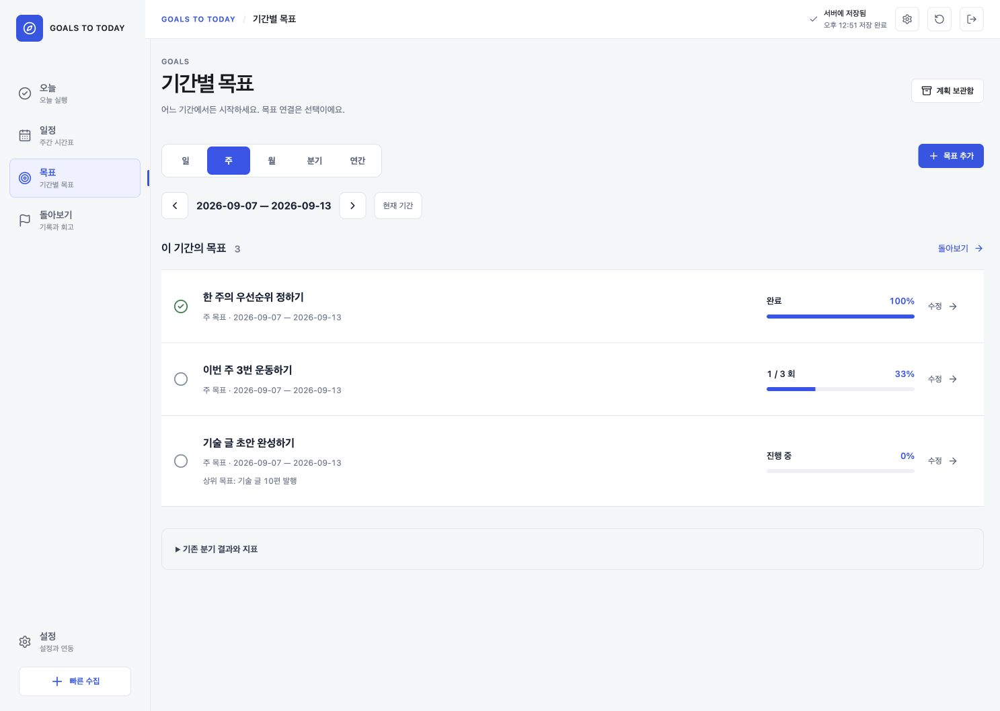
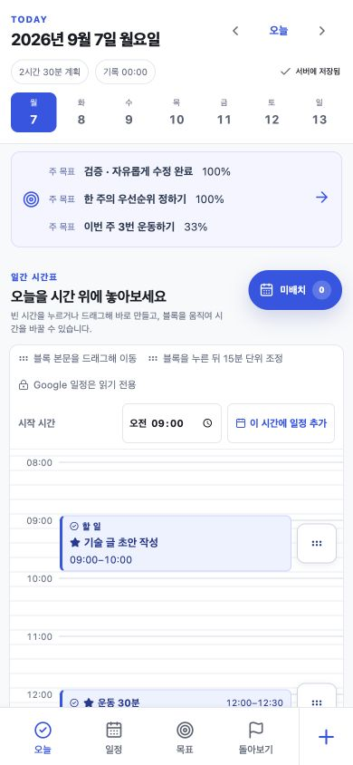
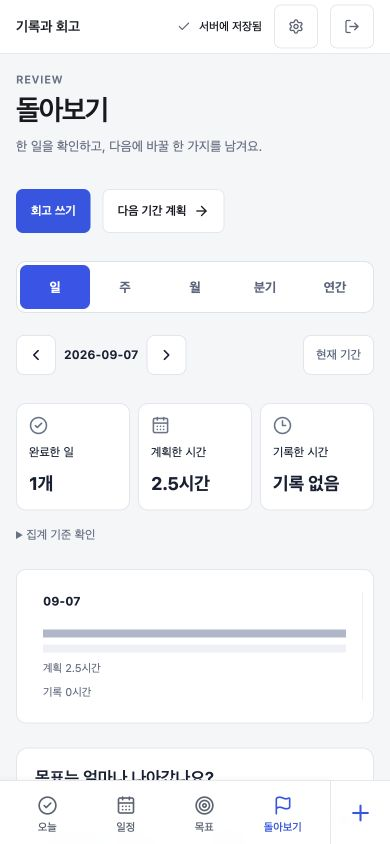
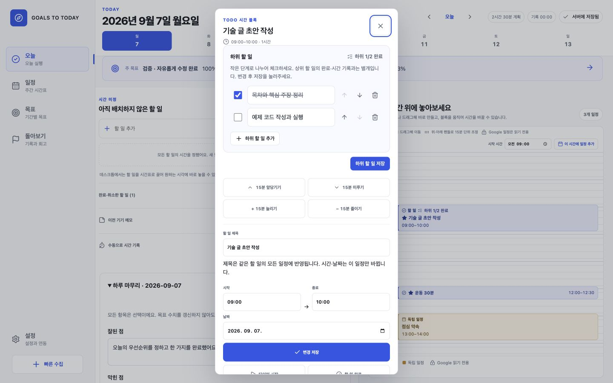
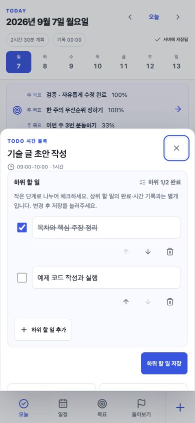
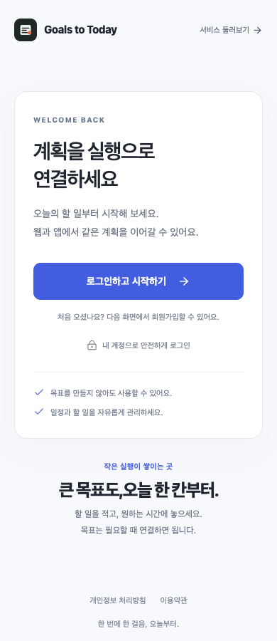
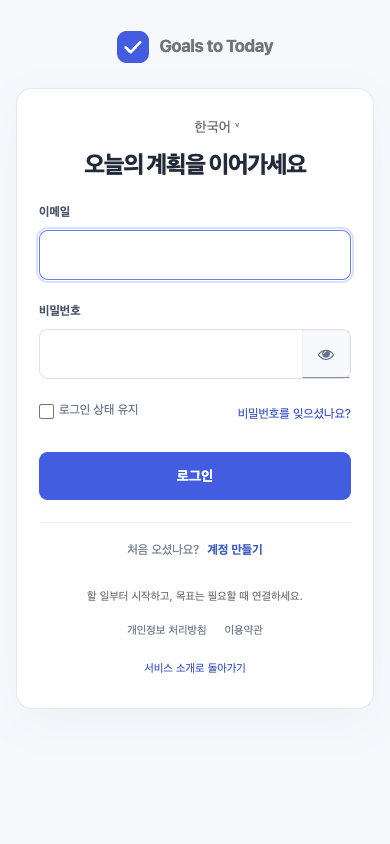
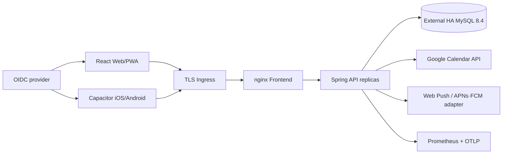

# Goals to Today

**기간별 목표 → 오늘 할 일·일정 → 짧은 하루 회고 → 주·월 단위 돌아보기**를 연결하는 개인 실행 플래너입니다. 목표를 만들지 않고 Todo나 캘린더만 써도 됩니다. 같은 React 코드가 웹/PWA와 Capacitor iOS·Android에서 실행되고, Java 25 Spring API와 MySQL 8.4가 여러 기기의 상태를 동기화합니다.


## 현재 구현 상태

### 2026-09-08 베타 개선

- **목표 나누기**: 목표의 `하위 목표` 버튼에서 작은 결과를 추가합니다. 연결 구조를 접거나 펼칠 수 있고 각 목표를 독립적으로 측정합니다.
- **월간 캘린더**: `일정 → 월간`에서 날짜를 선택하고 일정만 만들거나 기존 할 일을 배치합니다. 다른 달로 이동·수정·삭제할 수 있으며, 모바일에서는 달력을 먼저 보여줍니다.
- **주·월 AI 보고서**: 선택 동의, 예약 작성, 근거 스냅샷, 버전, 사용량·비용 제한을 구현했습니다. **운영 공급자·모델·예산이 미설정이면 비활성**이며, 실제 외부 호출 성공은 별도 검증 대상입니다. [AI 회고 운영 안내](docs/AI_REVIEW_REPORTS.md)
- **알림·로그인**: 새 계정의 사전 알림 기본값은 15분입니다. 기존 사용자가 저장한 값은 보존합니다. 자정·일정 변경/취소·중복 알림을 처리하고 알림을 누르면 해당 날짜로 이동합니다. 로그인 후 관리자·회고 등 원래 화면으로 복귀합니다.
- **운영·문의**: 설정에 베타 문의 초안과 관리자 진입점을 추가했습니다. Grafana 메모리 한도·경보를 보강하고 일일 MySQL 백업과 격리 복원 점검 도구를 제공합니다.

**배포 완료, 실계정 검증, 외부 설정 필요를 분리**해 [베타 릴리스 상태](docs/BETA_RELEASE_STATUS.md)에 기록합니다. [운영 체크](docs/BETA_OPERATIONS.md) · [소규모 베타 모집/마케팅 초안](docs/BETA_MARKETING.md) · [구글·15분 알림 검증 범위](docs/REMINDER_READINESS.md)

### 기간별 목표와 돌아보기

`오늘 → 일정 → 목표 → 돌아보기`로 주 메뉴를 정리했습니다. 목표 화면에서 **일·주·월·분기·연간**을 선택하고 제목만으로 시작할 수 있습니다. 상위 목표와 할 일 연결은 선택이며, 기존 Todo/24시간 시간표는 독립적으로 사용할 수 있습니다.

- **오늘**: 해당 날짜와 겹치는 목표를 확인하고, `하루 마무리`에서 잘된 점·막힌 점·다음에 바꿀 한 가지를 기록합니다.
- **목표**: 완료 여부 또는 기준값→목표값으로 측정합니다. 감소 목표도 지원하고, 할 일 완료·사용 시간을 목표 달성률로 바꾸지 않습니다.
- **돌아보기**: 이전/다음 기간의 완료한 일·계획 시간·기록 시간을 구분해서 확인합니다. 월요일에 열어도 기본은 지난주입니다. 날짜별 회고는 다시 열어 수정·삭제할 수 있습니다.
- **보존**: 기존 분기 결과는 `/goals/legacy`, 기존 주간 회고는 `/review/legacy`에 유지됩니다. 계획 보관함은 목표 화면에서 엽니다. 계정·날짜가 없는 기존 기기 메모는 자동 업로드하지 않습니다.
- **저장**: 신규 목표·회고는 활성 계획과 독립된 MySQL 데이터입니다. 문서별 revision과 mutation ID로 중복·덮어쓰기를 차단하고, 미저장 입력은 계정별로 기기에 보관합니다. 기존 플래너의 미해결 `invalid-precondition`을 우회하거나 초기화하는 기능이 아닙니다.

2026-09-07 로컬 검증: 프론트엔드 299개·백엔드 49개 테스트, production build, 별도 MySQL 백업·복원 검사가 통과했습니다. 실제 Chrome에서 목표 생성→새로고침→수정·완료, Today 완료 처리, 하루 회고 저장·날짜 이동을 Spring/MySQL까지 왕복 확인했습니다. 데스크톱과 모바일 390px·320px 화면도 확인했습니다.

main의 [CI](https://github.com/jieseob1/planner/actions/workflows/ci.yml)는 검사→이미지 발행→Mac mini 자동 배포를 수행합니다. 운영 반영은 코드 존재만으로 판단하지 않고 [`version.json`](https://goalstotoday.com/version.json)의 SHA와 배포 작업 성공을 함께 확인하세요. 기존 계정의 저장 충돌은 자동으로 어느 쪽도 선택하지 않았으며 과거 `invalid-precondition`의 정확한 요청 원인·복구는 별도 확인 대상입니다. 아래 화면은 운영 데이터가 아닌 격리된 로컬 테스트 데이터입니다. 상세 사용법·집계 기준은 [기간별 목표·회고 구현 안내](docs/PERIOD_GOALS_REVIEWS.md)를 참고하세요.



<p>
  
  
</p>

### 큰 할 일을 작은 단계로 나누기

할 일 제목이나 시간표 블록을 누르고 **`하위 할 일 추가`**를 선택합니다. 각 항목의 제목 수정·완료 체크·순서 변경·삭제·마지막 삭제 취소를 지원합니다. `변경 저장` 또는 `하위 할 일 저장` 후 상단의 서버 저장 완료를 확인하세요.

하위 항목은 한 단계의 체크리스트입니다. 모두 체크해도 상위 할 일이 자동 완료되거나 기록 시간이 늘어나지 않습니다. 같은 할 일의 여러 시간 블록에서 공유하고 `하위 1/3 완료`로 표시합니다. [사용법과 내부 저장 정책](docs/SUBTASKS.md)





### 할 일·일정 수정과 삭제

- **Today**: 시간 미정 목록의 제목을 눌러 제목·목표 연결·예상 시간·상태·메모를 수정합니다. `완료·취소한 할 일`에서도 수정하거나 다시 열 수 있습니다.
- **시간표**: 블록을 열어 제목·날짜·시간을 수정합니다. 연결된 할 일의 제목은 그 할 일의 모든 내부 일정에 반영되지만, 시간 변경은 선택한 일정에만 적용됩니다. 목표 연결은 선택입니다.
- **주간 일정**: `기존 할 일` 선택 아래에서 원래 할 일의 제목과 목표 연결을 바로 수정합니다. 25분·37분처럼 저장된 기존 길이를 임의로 반올림하지 않습니다.
- **삭제 범위**: `시간표에서 빼기`는 할 일·실행 기록을 남깁니다. `할 일 삭제`는 연결 일정·실행 기록도 삭제하므로 확인창에서 개수를 보여줍니다. Google에서 가져온 일정은 Google Calendar에서 관리합니다.
- **저장 안전성**: 제목 변경과 시간 변경을 함께 저장할 때 충돌하면 둘 다 적용하지 않습니다. API 프록시는 강한 ETag를 보존하며 Cloudflare에도 `no-store, no-transform`을 전달합니다. 과거 약한 ETag는 같은 서버 revision일 때만 재조회해 복구합니다. 새 서버 변경을 자동으로 덮어쓰지 않습니다.

생성→수정→새로고침→완료→다시 열기→삭제 여정은 `npm run verify:production:e2e`에서 실제 Spring·MySQL에 연결한 데스크톱/모바일 Chrome으로 검증합니다. 배포 프록시의 압축/ETag 회귀 검사는 `node scripts/verify-beta-etag.mjs`로 실행합니다(Docker 필요).

### 운영 화면과 모바일 빌드

- **운영 관리**: 관리자 계정으로 로그인하면 사이드바 `운영 관리`, 설정의 관리자 도구 또는 `/admin`에서 계정 수·최근 활동·캘린더 연결 문제·실패 작업·감사 기록을 조회합니다. 일반 계정은 서버에서 차단되며, 이메일은 마스킹하고 개인 계획 내용은 표시하지 않습니다. [백오피스 안내](docs/BACKOFFICE.md)
- **로그·CPU·메모리**: `/ops/grafana/`에 같은 관리자 계정으로 로그인합니다. Prometheus는 JVM·컨테이너 지표, Loki는 민감 정보 필터를 거친 중앙 로그를 수집합니다. 표시되는 CPU·메모리는 **kind Linux VM/컨테이너 기준**이며 Mac 하드웨어 전체 수치가 아닙니다. 로그 72시간, 메트릭 5일을 기본 보관합니다. [모니터링 운영 안내](docs/OBSERVABILITY.md)
- **저장된 Grafana 대시보드**: `Dashboards → Nowline`에서 운영 요약, API와 저장 오류, 서버 JVM DB, 중앙 로그를 확인합니다. 코드로 자동 등록되며 main 배포·재시작 후에도 유지됩니다. [바로가기와 해석 방법](docs/OBSERVABILITY.md#접속과-대시보드-사용법)
- **로그인**: 앱 진입 화면과 실제 Keycloak 로그인·가입·비밀번호 찾기에 반응형 디자인을 적용했습니다. 인증 검증·PKCE·암호 입력은 Keycloak의 기본 보안 흐름을 유지합니다.
- **Android·iOS**: `Mobile build CI`가 main/PR에서 테스트용 APK와 iOS 시뮬레이터 앱을 빌드해 Actions artifact로 제공합니다. 스토어 제출은 별개이며 Apple Developer·Google Play Console 가입과 서명 자료가 필요합니다. [앱 출시 절차](docs/MOBILE_RELEASE.md)

모니터링은 별도 네임스페이스에서 944MiB 메모리를 요청하고 합계 2432MiB로 제한합니다. Grafana 단독 한도는 768MiB입니다. Grafana 외 서비스는 인터넷에 노출하지 않습니다. 장비 한 대이므로 외부 백업·장애 알림 수신처·독립된 가용성 감시가 추가로 필요합니다. 설치/빌드 성공과 실제 데이터 수집/스토어 심사 성공을 구분해 검증합니다.

<p>
  
  
</p>

저장소 안의 제품·운영 코드와 로컬 다중 사용자 베타는 구현되어 있습니다. 공개 웹 주소는 [https://goalstotoday.com](https://goalstotoday.com)이며, Mac mini의 Kubernetes 서비스는 Cloudflare Tunnel을 통해서만 노출합니다. 자체 Keycloak 회원가입·OIDC, 무료 베타 권한, MySQL 영속 저장을 사용하며 공용 개발 토큰을 쓰지 않습니다. Google OAuth 게시·검증, 관리형 MySQL HA/PITR, Apple·Google 서명 계정은 각 공급자의 외부 자산이 준비되는 순서대로 연결해야 합니다.

| 영역 | 구현 내용 |
| --- | --- |
| 공개 랜딩 | 비로그인 `/` 제품 소개, 실제 제품 화면, 도구 비교, 무료 베타 안내, `/today` 시작 CTA, 모바일 반응형 |
| 계획 관리 | 여러 연간·분기 계획 생성, 활성화, 종료, 보관, 복원, immutable 변경 이력 |
| 실행 | Today Top 3, 타이머, 수동 시간, 완료 근거, 빠른 수집, 이월 결정 |
| 주간 운영 | 7일 시간 블록, 용량/겹침 방지, 외부 일정, 다음 주 계획 |
| 목표·회고 | 수치 목표, 신뢰도, 계획/실제 시간, 유지·축소·연장·중단 결정 |
| 동기화 | local-first, 오프라인 재시도, ETag, Idempotency-Key, 3-way 충돌 병합 |
| 인증·개인정보 | OIDC Authorization Code + PKCE, JWT tenant 격리, 필수 정책 동의, export, fresh-login 계정 삭제 |
| 베타 권한 | 가입 시 무료 BETA entitlement 자동 부여, 계정별 권한 조회·export·cascade 삭제, 향후 PRO/provider 필드 |
| Google Calendar | 최소 scope OAuth, 암호화 refresh token, 양방향 증분 sync, 410 복구, ETag, webhook watch, 재시도 |
| 알림 | 시간대/quiet hours, Web Push, iOS·Android push adapter, DB job lease, 중복 방지 |
| 운영 | Java 25 virtual threads, rate/body limit, 보안 헤더, Prometheus/OTel, TLS K8s overlay, CI/CD, SBOM·서명·스캔 |

신규 계정은 샘플 목표나 실행 기록을 생성하지 않습니다. 정책 동의 후 onboarding에서 입력한 연간 방향·분기 결과·첫 행동만 서버에 저장됩니다. 기능별 구현·QA 상태와 실제 외부 자산 경계는 [Feature QA matrix](./docs/FEATURE_QA_MATRIX.md)에 정리했습니다.

## 기존 공개 화면 — 위 기간별 목표 개편 전

웹의 `/`는 로그인 없이 열리는 공개 랜딩 페이지입니다. 제품의 계획 계층과 실행·회고 흐름을 실제 화면으로 설명하고, `웹앱 바로 시작`을 누르면 `/today`의 인증·온보딩 흐름으로 이동합니다. 네이티브 앱에서는 랜딩을 건너뛰고 바로 제품 화면으로 이동합니다.

<p align="center">
  
</p>


<table>
  <tr>
    <td width="50%"></td>
    <td width="50%"></td>
  </tr>
  <tr>
    <td><strong>Goals</strong><br />성과 수치, 근거 신뢰도, 시간 위험과 다음 결정을 관리합니다.</td>
    <td><strong>Review</strong><br />변화, 방해 요인과 다음 주 Top 3를 실행 계획으로 넘깁니다.</td>
  </tr>
</table>

<p align="center">
  
  
</p>

## 제품 흐름


Goals to Today는 장기 계획을 메모로만 보관하지 않습니다. 목표값·현재값·필요 시간·실제 시간·근거·다음 결정을 함께 저장하고, 계획 상태와 material change를 서버 감사 이력으로 남깁니다.

## 아키텍처



- API는 검증된 JWT의 issuer+subject로 tenant UUID를 계산합니다. 사용자 ID 헤더를 신뢰하지 않습니다.
- 서버 Pod는 세션·job 소유권·planner 상태를 메모리에 두지 않습니다.
- MySQL `SELECT ... FOR UPDATE` 사용자 행 잠금, transient deadlock 3회 재시도, revision과 ETag가 여러 Pod·기기의 동시 쓰기를 통제합니다.
- OAuth/푸시 credential은 AES-256-GCM과 사용자·기기 AAD로 암호화합니다.
- 가상 스레드와 DB pool은 별개이며 기본 Hikari 상한은 Pod당 10개입니다.

## 오늘 실행할 다중 사용자 로컬 베타

필요한 도구는 Node.js 24, Java 25, Docker, 현재 연결된 로컬 Kubernetes입니다. 다음 명령은 자체 Keycloak 회원가입, MySQL, Spring API 2개, React/PWA를 빌드하고 실제 사용자 2명의 가입·데이터 분리·재로그인을 검증한 뒤 `4189` 포트를 계속 열어 둡니다.

```bash
git clone https://github.com/jieseob1/planner.git
cd planner
npm run verify:beta:k8s
npm run k8s:serve:status
```

- 사용자 앱: [http://localhost:4189](http://localhost:4189)
- 종료: `npm run k8s:serve:stop` 후 `npm run k8s:down`
- 데이터: MySQL PVC는 workload를 내려도 유지됩니다.
- 베타 결제: 현재는 모든 신규 계정에 무료 BETA 권한만 부여하며 자동 결제하지 않습니다.

Docker Compose만 사용할 때는 `npm run beta:up`, `npm run verify:beta:runtime`, `npm run beta:backup` 순서로 실행하고 [http://localhost:8088](http://localhost:8088)에 접속합니다. 자세한 운영·백업·AWS 이전 절차는 [Local beta runbook](./docs/LOCAL_BETA_RUNBOOK.md)에 있습니다.

외부 사용자는 [https://goalstotoday.com](https://goalstotoday.com)으로 접속합니다. `127.0.0.1:4189`는 Goals to Today 전용 Cloudflare Tunnel의 origin으로만 사용하며 라우터 포트나 Kubernetes Service를 인터넷에 직접 열지 않습니다. 기존 Mac mini SSH 터널은 별도 tunnel이라 웹 배포·재시작의 영향을 받지 않습니다.

`main`에 push하면 CI(프론트·백엔드·매니페스트·E2E) 통과 후 ARM64 이미지를 GHCR에 게시하고, Mac mini의 `kind-nowline-local / nowline-local`에 자동 배포합니다. 배포 작업은 DB·로그인 데이터 백업, 이미지 교체, Ready Pod의 실제 이미지 ID와 공개 `/version.json` 검증까지 마쳐야 성공합니다. 실패하면 이전 Pod 템플릿으로 롤백하며 DB 백업은 보존합니다. 현재 배포 버전은 [version.json](https://goalstotoday.com/version.json)에서 확인할 수 있습니다. 실행기 설치·재배포·복구는 [자동 배포 운영 문서](docs/MAIN_AUTODEPLOY.md)를 참고하세요.

## 5분 단일 사용자 개발 실행

필요한 도구는 Node.js 24, Java 25, Docker입니다.

```bash
git clone https://github.com/jieseob1/planner.git
cd planner
npm ci
make compose-up
make compose-verify
```

- 앱: [http://localhost:8088](http://localhost:8088)
- readiness: [http://localhost:8080/actuator/health/readiness](http://localhost:8080/actuator/health/readiness)
- metrics: [http://localhost:8080/actuator/prometheus](http://localhost:8080/actuator/prometheus)

이 개발용 Compose는 외부에 노출하면 안 되는 `local-auth` profile과 로컬 전용 JWT secret을 사용합니다. 실제 사용자 베타에는 위의 `beta:*` 또는 `verify:beta:k8s` 명령만 사용합니다. 종료해도 MySQL volume은 보존됩니다.

```bash
make compose-logs
make compose-down
```

Vite HMR 개발은 MySQL/backend만 Compose로 실행한 다음 `npm run dev`를 사용합니다.

```bash
make backend-jar
docker compose up -d mysql backend
npm run dev
```

## 웹·앱 인증 설정

기본 예시는 [.env.example](./.env.example)에 있습니다.

```dotenv
VITE_AUTH_MODE=oidc
VITE_OIDC_AUTHORITY=https://goalstotoday.com/idp/realms/nowline
VITE_OIDC_CLIENT_ID=nowline-web
VITE_OIDC_WEB_REDIRECT_URI=https://goalstotoday.com/auth/callback
VITE_OIDC_NATIVE_REDIRECT_URI=com.jieseob.planner://auth/callback
```

네이티브 빌드는 Vite proxy를 쓸 수 없으므로 `VITE_API_BASE_URL`에 기기에서 접근 가능한 HTTPS origin을 넣습니다. localhost 자동 local-auth는 웹 개발에서만 동작하며, 네이티브는 명시적으로 local mode를 빌드하지 않는 한 OIDC를 사용합니다.

네이티브 전용 클라이언트는 `nowline-mobile`입니다. `mobile-ci.yml`의 production 환경 설정을 기준으로 사용하세요. `VITE_NATIVE_PUSH_ENABLED=false` 빌드는 APNs/FCM 없이 로그인·계획 기능을 사용할 수 있으며 푸시 등록을 시도하지 않습니다.

```bash
npm run cap:sync
npm run app:ios
npm run app:android
```

## 로컬 Kubernetes

현재 `kubectl` context를 그대로 사용하며 클러스터를 만들거나 바꾸지 않습니다.

```bash
npm run k8s:up
npm run k8s:verify
npm run verify:k8s:runtime
npm run verify:beta:k8s
```

local overlay는 MySQL PVC, MySQL-backed Keycloak, backend 2 replicas, HPA 2~6, PDB, startup/readiness/liveness probe와 topology spread를 포함합니다. `verify:beta:k8s`는 다중 사용자 브라우저 QA 후 로컬 포트포워드를 유지합니다. production overlay는 로컬 DB를 제거하고 TLS Ingress, default-deny NetworkPolicy, 전용 ServiceAccount, 외부 Secret/HA DB, migration Job, ServiceMonitor와 alerts 계약을 사용합니다.

## 검증

```bash
npm run verify:production # 아래 전체 검증 + migration runner + 복구 + 계약 + dependency audit
npm run verify:full       # React + PWA/mobile sync + Spring/Testcontainers + manifests + HTTP E2E
npm run verify:production:e2e # 실제 Chrome에서 인증·오프라인·충돌·Google·탈퇴 흐름 검증
npm run verify:production:reliability # backend 2대 부하·soak·failover·quota retry 검증
npm run verify:migration  # 운영과 같은 one-shot Flyway runner가 V8 적용 후 정상 종료
npm run verify:recovery   # MySQL 8.4 mysqldump/restore 무결성 drill
npm run verify:k8s:runtime # 현재 이미지를 local cluster에 넣고 두 Pod 동시성 검증
npm run verify:mysql-contract # production 코드·설정·테스트의 PostgreSQL 의존성 부재 검사
npm run verify:secrets    # Git 추적 파일의 private key/provider token signature 검사
npm run verify:beta       # 로컬 다중 사용자 베타 구현 전체 검증
npm run verify:beta:runtime # Compose에서 회원가입·tenant 격리·재로그인 검증
npm run verify:beta:backup  # 실제 무중단 MySQL dump·gzip·checksum 검증
npm run verify:beta:k8s     # 로컬 K8s 배포·동일 사용자 흐름·2 backend Ready 검증
npm run verify:goalstotoday:contracts # 새 브랜드·도메인·배포 계약 검증
npm run verify:goalstotoday:public    # 공개 HTTPS·OIDC·SSH·데스크톱/모바일 smoke 검증
npm run verify:goalstotoday:deployment # 로컬·GitHub·Mac mini revision 일치 검증
```

Mac mini는 GUI 로그인 없이 복구되는 headless boot service로 Colima·Kubernetes 포트포워드와 전용 Cloudflare Tunnel을 운영합니다. system LaunchDaemon을 우선 사용하고 sudo 인증을 사용할 수 없는 원격 복구에서는 system cron `@reboot` fallback을 사용합니다. 설치·장애 판별·검증 절차는 [Local beta runbook](./docs/LOCAL_BETA_RUNBOOK.md)과 [Operations runbook](./docs/OPERATIONS_RUNBOOK.md)에 있습니다.

`verify:k8s:runtime`은 현재 Kubernetes context를 바꾸지 않으며, local overlay와 현재 이미지를 적용합니다. 두 backend Pod에 직접 동시 요청해 하나만 ETag update에 성공하고 최종 상태가 일치하는지 확인합니다.

`verify:production:e2e`와 `verify:production:reliability`는 매 실행마다 격리된 MySQL 8.4·backend·가짜 Google Calendar 공급자를 만들고 종료합니다. 전자는 데스크톱/모바일 인증 사용자 여정과 실제 PUT 저장, 키보드 조작, 200% 확대 핵심 모달, focus trap·복귀, light-only/reduced-motion을 Chrome으로 확인합니다. 후자는 두 backend 인스턴스의 부하·30초 soak·동시 수정·단일 인스턴스 중단·Google 429 재시도를 확인합니다. 기준과 최근 측정값은 [Reliability baseline](./docs/RELIABILITY_BASELINE.md)에 있습니다.

이전 로컬 PostgreSQL 데이터는 삭제하지 않습니다. Compose volume과 Kubernetes PVC를 각각 custom-format dump로 보존한 뒤, 비어 있는 MySQL에 [one-time migration tool](./scripts/legacy-data-migration/README.md)로 이관하고 테이블별 건수와 planner 지문을 대조합니다. 검증 후에는 PostgreSQL workload만 내리고 원본 volume/PVC와 dump는 복구용으로 유지합니다.

네이티브 CI는 Android JDK 21·Gradle wrapper 8.14.3과 iOS Xcode 26 이상을 사용합니다. `Mobile build CI`의 해당 커밋 실행 결과와 실제 artifact를 확인해야 빌드 성공을 판단할 수 있습니다. 시뮬레이터 빌드는 iPhone에 배포할 IPA가 아니며, 실기기 인증·알림·백그라운드·계정 삭제 QA와 스토어 제출은 별도로 필요합니다.

CI는 PR마다 프론트/백엔드/E2E/CodeQL을 수행합니다. release workflow는 두 이미지를 SBOM·provenance와 함께 빌드하고, HIGH/CRITICAL scan, keyless cosign 서명, migration Job, digest 고정 rollout을 수행합니다.

## 남은 작업 — 기능 완성과 운영 준비를 구분합니다

- **AI 주간·월간 보고서**: [설계 명세](docs/AI_REVIEW_REPORTS.md)만 작성했습니다. AI 제공자/API 키, 월 예산, 자동 발행 여부를 확정한 뒤 생성 worker·근거 저장·실패/비용 제어·보고서 UI를 구현해야 합니다. 현재 돌아보기는 수동 회고와 코드로 집계한 요약이며 AI 결과가 아닙니다.
- **과거 실제 계정의 저장 오류**: 2026-09-07 15:05 KST 공개 Today는 `서버에 저장됨`과 실행 중 타이머가 표시됐습니다. 과거 `HTTP 400 invalid-precondition`의 해당 요청 원인은 아직 미확인입니다. 현재 화면 상태를 과거 오류의 근본 해결 증거로 간주하지 않으며 실제 데이터의 충돌 선택이나 기기 초기화는 하지 않았습니다.
- **하위 할 일 확장**: 현재 한 단계 체크리스트까지 제공합니다. 다단계 트리·하위 항목 자체 일정/마감일/알림은 별도 기능입니다.
- **기간 관리 후속 개선**: 월간 일정 보기, 실제 실행 구간의 자정/DST 분할, 완료/재완료 이벤트 이력, 회고 시점의 실행 요약 불변 저장, 대량 기록 페이지네이션이 남았습니다.
- **모바일 스토어 출시**: Apple Developer·Google Play Console 계정, 서명과 APNs/FCM 설정, 실기기 로그인/알림/백그라운드 QA, 심사·등록이 필요합니다. CI 빌드는 스토어 출시 완료가 아닙니다.
- **유료 서비스 전환**: 현재 무료 베타입니다. 결제 사업자 선정·계정 준비, 결제/구독/webhook/환불·권한 전환과 약관/세무 검토가 필요합니다.
- **한 대 서버의 운영 위험**: 외부 백업 보관·정기 복구 훈련, 장애 알림 수신처, 디스크/전원 장애 대응을 운영 절차로 확정해야 합니다. 관리형 DB로 옮길 때 HA/PITR·TLS·복원 검증은 별도입니다.

### 운영자가 관리할 외부 자산

아래 항목은 저장소에서 대신 발급하거나 승인할 수 없습니다. 이미 연결된 도메인·Tunnel·Keycloak도 갱신·복구 책임이 필요한 자산이며, 이 목록 전체가 미설정이라는 뜻은 아닙니다.

- Cloudflare 계정·Tunnel과 `goalstotoday.com` DNS/TLS 운영 권한
- Keycloak 운영 admin 복구·백업과 테스트 계정
- Google Cloud OAuth client, 검증된 domain, 동의 화면 게시/검증
- 관리형 MySQL 8.4의 HA, 자동 backup, PITR와 실제 복구 증거
- Secret Manager, OTLP collector, Prometheus alert 수신 채널
- VAPID와 APNs/FCM adapter credential
- Apple Developer/Google Play 계정, signing key, physical-device와 store 심사
- 운영 주체의 개인정보 보관기간·연락처·약관 법률 검토

설정 순서와 값은 [Production setup](./docs/PRODUCTION_SETUP.md), 장애·복구 절차는 [Operations runbook](./docs/OPERATIONS_RUNBOOK.md), 앱 출시는 [Mobile release checklist](./docs/MOBILE_RELEASE.md)에 있습니다.

## 프로젝트 구조

```text
planner/
├── src/                         React 화면, 인증, 상태, API clients
├── backend/                     Java 25 Spring API, Flyway, 통합 테스트
├── infra/k8s/base/              공통 Deployment/Service/HPA/PDB
├── infra/k8s/overlays/local/    로컬 DB 포함 개발 runtime
├── infra/k8s/overlays/production/ TLS/보안/관측/외부 DB 계약
├── android/ · ios/              Capacitor native projects
├── scripts/                     build, E2E, scale-out, recovery verifiers
├── docs/                        운영·설계·사용성 문서와 screenshots
└── .github/workflows/           CI, CodeQL, container/mobile release
```

## 기술 스택

| 구분 | 기술 |
| --- | --- |
| Frontend | React 19, TypeScript 7, React Router 7, Vite 8, Vitest 4 |
| Web/App | PWA/Workbox, Capacitor 8, iOS, Android, secure storage |
| Backend | Java 25, Spring Boot 4.1.1, Spring MVC virtual threads, JDBC/Flyway |
| Data | MySQL 8.4 LTS, InnoDB, normalized planner schema, audit/job/lease tables |
| Security | OAuth2 Resource Server, OIDC PKCE, AES-GCM, rate/body limits, CSP/HSTS |
| Operations | Kubernetes/Kustomize, Prometheus, OpenTelemetry, GitHub Actions, Cosign, Trivy |

## 문서

- [Production setup](./docs/PRODUCTION_SETUP.md)
- [Local beta runbook](./docs/LOCAL_BETA_RUNBOOK.md)
- [Operations runbook](./docs/OPERATIONS_RUNBOOK.md)
- [Mobile release checklist](./docs/MOBILE_RELEASE.md)
- [백오피스 운영](./docs/BACKOFFICE.md)
- [Grafana·Prometheus·Loki 운영](./docs/OBSERVABILITY.md)
- [Backend architecture](./docs/BACKEND_ARCHITECTURE.md)
- [Backend API](./backend/README.md)
- [Compose/Kubernetes](./infra/README.md)
- [Design spec](./DESIGN_SPEC.md)
- [Production UX audit](./docs/PRODUCTION_UX_AUDIT.md) · [usability sources](./docs/USABILITY_REFERENCES.md)
- [Reliability baseline](./docs/RELIABILITY_BASELINE.md)
- [Feature QA matrix](./docs/FEATURE_QA_MATRIX.md)
- [Acceptance gates](./GATES.md)
- [Claude Design source](https://claude.ai/design/p/97a88bc6-c95f-4bc3-9e8f-ed453200caef?file=Planner_HighFidelity.dc.html)
