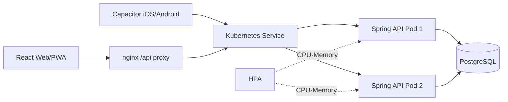

# Nowline

연간·분기 목표를 **측정 가능한 결과 → 다음 행동 → 주간 시간 블록 → 오늘 실행 → 회고**로 연결하는 개인 실행 플래너입니다. React 웹/PWA와 Capacitor iOS·Android 앱이 같은 화면과 Spring API 계약을 사용합니다.


> 현재 범위는 로컬에서 실행하는 풀스택 MVP입니다. Spring API와 PostgreSQL 동기화까지 구현되어 있지만 로그인은 아직 없으며, `X-Nowline-User-Id`는 개발용 신뢰 헤더입니다. 인터넷에 공개하기 전에는 반드시 실제 인증으로 교체해야 합니다.

## 무엇을 관리하나요?

| 질문 | Nowline의 관리 방식 |
| --- | --- |
| 올해와 이번 분기에 무엇을 만들 것인가? | 1년 방향과 분기 결과를 연결 |
| 완료 여부를 무엇으로 판단할 것인가? | 현재값·목표값·신뢰도·다음 점검일 관리 |
| 실제로 실행할 시간이 있는가? | 필요 시간과 가용 시간을 비교하고 주간 블록에 배치 |
| 오늘 무엇부터 끝낼 것인가? | Top 3와 한 번에 하나의 실행 타이머 제공 |
| 무엇을 했다는 근거가 남는가? | 실제 시간, 결과 수치, 완료 근거 기록 |
| 계속할 것인가? | 유지·축소·연장·중단 결정을 회고에서 관리 |


## 구현된 기능

| 영역 | 기능 |
| --- | --- |
| Today | 오늘의 Top 3, 타이머·일시정지·종료, 수동 시간, 완료 근거, 빠른 수집, 이월 작업 결정 |
| Planner | 여러 주 이동, 다음 행동 생성, 7일 시간표, 외부 일정, 용량 경고, 시간 겹침 방지, 모바일 배치 시트 |
| Goals | 1년 → 분기 → 결과 구조, 현재·목표 수치, 신뢰도, 계획·실제 시간, 결정 큐 |
| Review | 결과 수치 반영, 방해 요인, 다음 주 Top 3, 다음 주 Planner 전달 |
| 동기화 | localStorage 우선 복원, 서버 자동 저장, 오프라인 보존·재시도, ETag 충돌 감지 |
| 웹·앱 | 반응형 PWA, 오프라인 정적 화면, Capacitor iOS·Android 프로젝트 |
| 서버 | Java 25 가상 스레드, PostgreSQL/Flyway, 멱등성, 낙관적 잠금, Problem Details |
| 로컬 운영 | Docker Compose, Kustomize, backend 2 replicas, HPA, PDB, probe, topology spread |

### 주요 화면


<table>
  <tr>
    <td width="50%"></td>
    <td width="50%"></td>
  </tr>
  <tr>
    <td><strong>Goals</strong><br />분기 결과의 진행률, 근거 신뢰도, 시간 위험을 보고 다음 결정을 내립니다.</td>
    <td><strong>Review</strong><br />달라진 수치, 방해 요인, 다음 주 Top 3를 한 번에 정리합니다.</td>
  </tr>
</table>

<p align="center">
  
  
</p>

## 아키텍처



- Spring Pod는 사용자 세션이나 플래너 상태를 메모리에 두지 않습니다.
- `ETag`·`If-Match`가 오래된 기기의 덮어쓰기를 차단합니다.
- `Idempotency-Key`가 모바일 네트워크 재시도의 중복 쓰기를 막습니다.
- 사용자별 PostgreSQL advisory lock과 단조 증가 revision이 여러 Pod의 동시 쓰기와 삭제 후 ABA를 막습니다.
- 가상 스레드와 DB 연결 수는 분리합니다. Hikari 기본 상한은 Pod당 10개입니다.

자세한 내용은 [백엔드 아키텍처](./docs/BACKEND_ARCHITECTURE.md)와 [백엔드 실행·API 문서](./backend/README.md)를 참고하세요.

## 가장 빠른 실행: Docker Compose

### 준비물

- Node.js `^20.19.0` 또는 `>=22.12.0`
- Java 25
- Docker와 Docker Compose

```bash
git clone https://github.com/jieseob1/planner.git
cd planner
npm ci
make compose-up
make compose-verify
```

- 웹: [http://localhost:8088](http://localhost:8088)
- Spring readiness: [http://localhost:8080/actuator/health/readiness](http://localhost:8080/actuator/health/readiness)
- Prometheus metrics: [http://localhost:8080/actuator/prometheus](http://localhost:8080/actuator/prometheus)

`make compose-up`은 프런트 프로덕션 빌드와 Spring JAR를 먼저 만든 뒤 PostgreSQL·backend·frontend를 시작합니다. 종료해도 DB 볼륨은 보존됩니다.

```bash
make compose-logs
make compose-down
```

포트 충돌 시 `NOWLINE_FRONTEND_PORT`와 `NOWLINE_BACKEND_PORT`를 바꿀 수 있습니다.

## 개발 서버

백엔드와 PostgreSQL을 Compose로 띄우고 Vite HMR을 사용하려면 다음처럼 실행합니다.

```bash
make backend-jar
docker compose up -d postgres backend
npm run dev
```

Vite는 `/api`를 `http://localhost:8080`으로 프록시합니다. 기본 화면은 [http://localhost:5173/today](http://localhost:5173/today)입니다.

## 로컬 Kubernetes

헬퍼는 현재 `kubectl` context를 사용하며 클러스터를 만들거나 context를 임의로 바꾸지 않습니다. `kind` context에서는 같은 태그로 새로 빌드한 이미지를 노드에 로드하고 backend/frontend Deployment를 다시 시작합니다.

```bash
npm run k8s:up
npm run k8s:verify
npm run verify:k8s:runtime
```

구성은 다음을 포함합니다.

- PostgreSQL StatefulSet과 5Gi PVC
- Spring backend 기본 2 replicas, CPU·Memory HPA 2~6
- liveness/readiness/startup probe, RollingUpdate, PDB, topology spread
- 비루트·read-only frontend/backend 컨테이너와 리소스 request/limit

```bash
npm run k8s:down
```

`k8s:down`은 Nowline workload만 제거하고 namespace와 PostgreSQL PVC는 보존합니다. 상세 동작은 [로컬 런타임 문서](./infra/README.md)를 확인하세요.

## PWA와 iOS·Android

```bash
npm run cap:sync
npm run app:ios
npm run app:android
```

네이티브 앱은 Vite proxy를 사용할 수 없으므로 빌드 시 기기에서 접근 가능한 API 주소를 지정합니다.

```bash
# iOS Simulator
VITE_API_BASE_URL=http://localhost:8080 npm run cap:sync

# Android Emulator
VITE_API_BASE_URL=http://10.0.2.2:8080 npm run cap:sync
```

Android는 cleartext HTTP를 기본 차단하고 `localhost`, `127.0.0.1`, `10.0.2.2`만 로컬 개발 예외로 허용합니다. iOS도 로컬 네트워크 예외만 선언합니다. 실기기와 운영 API는 HTTPS를 사용해야 하며, 플랫폼별 서명과 스토어 배포 설정은 별도입니다.

## API 요약

모든 요청은 현재 로컬 사용자 UUID가 필요합니다. PUT/DELETE에는 `Idempotency-Key`도 필수입니다.

| 메서드 | 경로 | 조건 | 결과 |
| --- | --- | --- | --- |
| `GET` | `/api/v1/planner` | 선택 `If-None-Match` | `{ revision, snapshot }`, `ETag`; 없으면 404, 동일하면 304 |
| `PUT` | `/api/v1/planner` | 최초 `If-None-Match: *`, 이후 `If-Match: "revision"` | 전체 snapshot 생성·교체 |
| `DELETE` | `/api/v1/planner` | `If-Match: "revision"` | 현재 revision의 planner 삭제 |

주요 실패는 RFC Problem Details로 반환합니다. 잘못된 데이터는 400, 멱등 키 오용은 409, 오래된 revision은 412, 조건 누락은 428입니다.

## 검증

Docker가 실행 중인 환경에서 전체 정적·통합 검증은 다음 한 명령으로 실행합니다.

```bash
npm run verify:full
```

이 명령은 다음을 확인합니다.

- React 26개 사용자 흐름·동기화 단위 테스트
- 구조·디자인·접근성·PWA 빌드와 Capacitor 동기화
- Java 25 Spring 단위·Testcontainers PostgreSQL 통합 테스트
- Kustomize 10개 리소스의 구조 계약
- 임시 Compose DB를 사용하는 생성·조회·멱등 재시도·충돌·수정·삭제 E2E

실행 중인 로컬 Kubernetes가 있을 때는 별도로 실제 2-Pod 경로를 검증합니다.

```bash
npm run verify:k8s:runtime
```

이 검증은 frontend `/api` proxy, 두 backend Pod의 동일 데이터 조회, 서로 다른 Pod로 보낸 동시 `If-Match` 쓰기에서 정확히 하나만 성공하는지, HPA metrics를 확인합니다.

## 기술 스택

| 구분 | 기술 |
| --- | --- |
| 프런트 | React 19, TypeScript 7, React Router 7, Vite 8, Vitest 4 |
| 웹·앱 | PWA/Workbox, Capacitor 8, iOS, Android |
| 백엔드 | Java 25, Spring Boot 4.1.1, Spring MVC, virtual threads, JDBC, Flyway |
| 데이터 | PostgreSQL 17, 정규화 스키마, exclusion constraint |
| 관측 | Spring Actuator, Prometheus endpoint |
| 로컬 운영 | Docker Compose, Kustomize, kind, HPA, PDB |

## 프로젝트 구조

```text
planner/
├── src/                    React 화면, 상태, API client, 도메인 타입
├── backend/                Java 25 Spring API, Flyway, 테스트, Dockerfile
├── infra/k8s/              Kustomize base와 local overlay
├── scripts/                프런트·API·K8s·E2E 검증
├── docs/                   아키텍처, 사용성 감사, 스크린샷
├── ios/                    Capacitor iOS 프로젝트
├── android/                Capacitor Android 프로젝트
├── compose.yaml            PostgreSQL·backend·frontend 로컬 스택
├── Makefile                반복 가능한 빌드·실행 명령
└── GATES.md                완료 조건과 실제 검증 근거
```

## 현재 한계와 운영 전 필수 보완

- `X-Nowline-User-Id`는 인증이 아닙니다. OIDC/JWT와 Spring Security로 서버가 사용자 ID를 결정해야 합니다.
- 충돌 시 로컬 변경은 보존되지만 서버 데이터와 수동으로 병합하는 UI는 아직 없습니다.
- 한 사용자당 하나의 현재 연간·분기 plan을 관리합니다. 복수 plan 이력 UI는 후속 범위입니다.
- 외부 캘린더, 푸시 알림, 실행 기록 전체 편집·감사 화면은 아직 없습니다.
- 운영에서는 TLS, 외부 Secret 관리, NetworkPolicy, rate/request-size limit, idempotency 보존 정책, PostgreSQL 백업·PITR가 필요합니다.
- 로컬 단일 PostgreSQL StatefulSet은 운영 HA 설계가 아닙니다.

## 다음 작업 우선순위

1. `X-Nowline-User-Id`를 OIDC/JWT 로그인과 Spring Security Resource Server로 교체
2. 412 충돌 시 로컬·서버 변경을 비교하고 선택적으로 병합하는 화면 추가
3. 여러 연간·분기 plan의 생성·종료·보관 이력과 변경 감사 화면 추가
4. 관리형 PostgreSQL, 백업·PITR, TLS, 외부 Secret, NetworkPolicy, rate/request-size limit 적용
5. iOS·Android 실기기 API 연결, 알림 권한, 서명, 스토어 배포 검증
6. Google·Apple 캘린더 연동과 실행·회고 알림 추가

## 문서

- [백엔드 아키텍처](./docs/BACKEND_ARCHITECTURE.md)
- [백엔드 API와 실행](./backend/README.md)
- [Docker Compose·Kubernetes](./infra/README.md)
- [디자인 시스템](./DESIGN_SPEC.md)
- [사용성 감사](./docs/USABILITY_AUDIT.md)
- [사용성 기준과 출처](./docs/USABILITY_REFERENCES.md)
- [Claude Design 원본](https://claude.ai/design/p/97a88bc6-c95f-4bc3-9e8f-ed453200caef?file=Planner_HighFidelity.dc.html)
