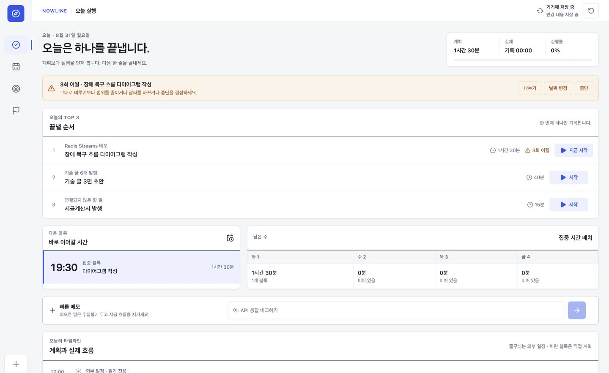
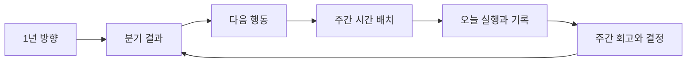

# Nowline

연간·분기 목표를 **측정 가능한 결과 → 다음 행동 → 주간 시간 블록 → 오늘의 실행 → 회고**로 연결하는 개인 실행 플래너입니다.

할 일을 메모하는 데서 끝내지 않고, “무엇을 언제 실행했고 결과가 어떻게 달라졌는가”까지 관리하는 것이 목표입니다. 하나의 React 코드베이스를 웹 PWA와 iOS·Android 앱에서 함께 사용합니다.

> 현재 저장소는 프론트엔드 MVP입니다. 데이터는 브라우저 `localStorage`에 저장되며, 로그인·클라우드 동기화·Spring API는 아직 연결되지 않았습니다.



## 왜 만들었나요?

일반적인 메모·할 일 앱은 작업을 적는 데는 편하지만, 장기 목표가 오늘의 시간표와 실제 실행 기록까지 이어지는지는 보여주기 어렵습니다. Nowline은 아래 질문을 한 흐름 안에서 관리합니다.

| 질문 | Nowline에서 관리하는 방식 |
| --- | --- |
| 올해와 이번 분기에 무엇을 만들 것인가? | 1년 방향과 분기 결과를 계층으로 연결 |
| 완료 여부를 무엇으로 판단할 것인가? | 현재값·목표값·신뢰도·다음 점검일 관리 |
| 이번 주에 실제로 할 시간이 있는가? | 필요 시간과 가용 시간을 비교하고 주간 블록에 배치 |
| 오늘 무엇부터 끝낼 것인가? | Top 3와 한 번에 하나의 실행 타이머 제공 |
| 무엇을 했다는 근거가 남는가? | 실제 시간과 완료 근거 기록 |
| 계속할 것인가, 줄이거나 중단할 것인가? | 지연·시간 부족·근거 없음 상태를 결정 큐로 관리 |

## 사용 흐름



1. `Goals`에서 1년 방향과 이번 분기의 측정 가능한 결과를 정합니다.
2. 결과를 이루기 위한 가장 작은 다음 행동과 예상 시간을 만듭니다.
3. `Planner`에서 외부 일정과 가용 시간을 보며 이번 주 시간 블록에 배치합니다.
4. `Today`에서 Top 3 중 하나를 실행하고 실제 시간과 완료 근거를 남깁니다.
5. `Review`에서 결과 수치, 방해 요인, 다음 주 Top 3를 갱신합니다.
6. 지연되거나 시간이 부족한 결과는 유지·축소·기한 연장·중단 중 하나로 결정합니다.

## 주요 화면

### 주간 계획

목표별 필요·계획·실제 시간을 같은 표에서 비교하고, 아직 배치하지 않은 다음 행동을 7일 시간표에 놓습니다. 외부 일정은 읽기 전용 블록으로 구분됩니다.


### 목표와 주간 회고

<table>
  <tr>
    <td width="50%"></td>
    <td width="50%"></td>
  </tr>
  <tr>
    <td><strong>Goals</strong><br />분기 결과의 진행률, 근거 신뢰도, 실제·계획 시간, 지연 상태를 보고 다음 결정을 내립니다.</td>
    <td><strong>Review</strong><br />달라진 수치, 가장 큰 방해 요인, 다음 주 Top 3를 한 번에 정리합니다.</td>
  </tr>
</table>

### 모바일

390px 화면에서는 데스크톱 레일이 하단 탭과 빠른 수집 버튼으로 바뀝니다. 주간 계획의 드래그 앤 드롭은 날짜·시간을 고르는 배치 시트 방식으로 대체됩니다.

<p align="center">
  
  
</p>

## 구현된 기능

| 영역 | 기능 |
| --- | --- |
| Today | 오늘의 Top 3, 실행 타이머, 일시정지·종료, 실제 시간, 완료 근거, Enter 빠른 수집, 이월 작업 바로가기, 수동 시간 실행 취소 |
| Planner | 주 이동, 다음 행동 생성, 7일 시간표, 외부 일정 표시, 용량 경고, 충돌 예방, 재배치, 모바일 배치 시트 |
| Goals | 1년 → 분기 → 결과 구조, 계획·선택 결과 편집, 현재·목표 수치, 신뢰도, 시간 위험, 결정 큐 |
| Review | 실제 결과 수치 검증·반영, 방해 요인 선택, 다음 주 Top 3, 다음 주 Planner 연결 |
| Onboarding | 원하는 결과 → 다음 행동 → 비어 있는 실행 시간으로 이어지는 3단계 첫 설정 |
| 공통 | 기기 로컬 자동 저장, 초기화 확인, 반응형 UI, 키보드 포커스, 44px 모바일 조작 영역, PWA 설치 |
| Native | Capacitor 기반 iOS·Android 프로젝트와 웹 빌드 동기화 |

## 현재 구현 범위와 한계

### 지금 사용할 수 있는 것

- 모든 주요 화면과 데모 데이터
- 빠른 수집, 작업 생성, 여러 주 이동, 충돌 없는 시간 배치, 타이머, 수동 시간과 즉시 실행 취소
- 1년·분기 계획 편집, 목표 결정, 결과 수치 반영, Review Top 3의 다음 주 전달
- 새로고침 후에도 유지되는 브라우저 로컬 저장과 `기기에 저장됨` 상태 표시
- 설치형 PWA와 오프라인 정적 화면
- Capacitor iOS·Android 네이티브 셸

### 아직 연결되지 않은 것

- Spring Boot API, 데이터베이스, 회원가입·로그인
- 사용자별 데이터 분리, 클라우드 백업, 여러 기기 동기화
- 복수 연간·분기 계획과 결과의 전체 생성·삭제
- 시간 블록의 직접 이동·삭제와 서버 기준 동시성 검사
- 실행 근거·수동 시간 기록을 모아 수정·삭제하는 이력 화면
- Google·Apple 등 외부 캘린더 실제 연동
- 푸시 알림, 실제 기기 빌드, 앱스토어 서명과 배포 설정

외부 일정과 초기 연간·분기 데이터는 데모 데이터입니다. 화면은 서버 동기화를 주장하지 않고 `기기에 저장됨`으로 현재 범위를 표시합니다. PWA와 네이티브 앱의 표시 이름은 `Nowline`이며, 앱의 기술 식별자는 기존 호환성을 위해 `com.jieseob.planner`를 유지합니다.

## 기술 스택

| 구분 | 기술 |
| --- | --- |
| UI | React 19, TypeScript 7, CSS, Lucide React, clsx |
| 라우팅 | React Router 7 |
| 빌드 | Vite 8 |
| 상태·저장 | React Context, `localStorage` |
| 테스트 | Vitest 4, Testing Library, jsdom |
| 웹 앱 | `vite-plugin-pwa`, Workbox |
| 모바일 앱 | Capacitor 8, iOS, Android |
| 백엔드 | Spring Boot 연동 예정 — 현재 저장소에는 포함되지 않음 |

## 빠른 시작

### 준비물

- Node.js `^20.19.0` 또는 `>=22.12.0`
- npm

### 설치와 실행

```bash
git clone https://github.com/jieseob1/planner.git
cd planner
npm ci
npm run dev
```

기본 주소는 [http://localhost:5173](http://localhost:5173)입니다. 이미 사용 중인 포트라면 터미널에 표시되는 다른 주소를 엽니다. 첫 설정 흐름은 `/onboarding`에서 바로 확인할 수 있습니다.

### 주요 경로

| 경로 | 화면 |
| --- | --- |
| `/today` | 오늘의 우선 작업과 실행 기록 |
| `/planner` | 주간 시간 배치 |
| `/goals` | 연간·분기 목표와 결과 결정 |
| `/review` | 주간 회고 |
| `/onboarding` | 첫 목표·행동·시간 설정 |

## 검증

릴리스 기준 검증은 한 명령으로 실행합니다.

```bash
npm run verify:release
```

이 명령은 다음 항목을 차례로 확인합니다.

- 컴포넌트·사용자 흐름 테스트
- 활성 상태의 무동작 버튼, 로컬 저장 문구, 모바일 조작 영역 등 사용성 계약
- 필수 화면과 프로젝트 구조
- 디자인 원본과 시각 토큰
- TypeScript 및 프로덕션 빌드
- PWA 산출물
- Capacitor iOS·Android 동기화 결과

`verify:release`의 네이티브 검증은 동기화된 프로젝트·설정·웹 산출물의 존재를 확인합니다. 이번 사용성 패스에서는 Android `assembleDebug`도 JDK 21로 별도 실행해 4.1MB 디버그 APK 생성을 확인했습니다. iOS 실제 빌드는 전체 Xcode가 설치된 Mac에서 추가로 확인해야 합니다.

개별 검증이 필요하면 아래 명령을 사용할 수 있습니다.

```bash
npm run verify:unit
npm run verify:structure
npm run verify:design-source
npm run verify:visual-system
npm run verify:usability
npm run verify:build
npm run verify:mobile
```

## PWA와 모바일 앱

### 프로덕션 웹 빌드

```bash
npm run build
npm run preview
```

### 네이티브 프로젝트 동기화

```bash
npm run cap:sync
```

### iOS·Android IDE 열기

```bash
npm run app:ios
npm run app:android
```

Android 디버그 APK만 만들려면 JDK 21 환경에서 다음을 실행합니다.

```bash
cd android
./gradlew assembleDebug
```

성공한 APK는 `android/app/build/outputs/apk/debug/app-debug.apk`에 생성됩니다.

`app:ios`는 macOS와 Xcode가, `app:android`는 Android Studio와 Android SDK가 필요합니다. 실제 기기 설치와 스토어 배포에는 플랫폼별 서명 설정이 별도로 필요합니다.

## 프로젝트 구조

```text
planner/
├── src/
│   ├── components/       공통 UI와 앱 셸
│   ├── screens/          Today, Planner, Goals, Review, Onboarding
│   ├── state/            상태 명령과 localStorage 저장
│   ├── domain/           Task, Outcome, TimeBlock 등 도메인 타입
│   ├── data/             데모 데이터
│   ├── App.tsx           라우트 구성
│   └── styles.css        반응형 디자인 시스템
├── scripts/              릴리스 검증 스크립트
├── docs/screenshots/     README 실제 화면 캡처
├── public/               PWA 아이콘
├── ios/                  Capacitor iOS 프로젝트
├── android/              Capacitor Android 프로젝트
├── DESIGN_SPEC.md        디자인 원본과 구현 규칙
├── GATES.md              구현 완료 조건과 검증 근거
└── capacitor.config.ts   네이티브 앱 설정
```

## Spring 연동 방향

현재 `PlannerProvider`가 화면 명령과 로컬 저장의 경계 역할을 합니다. Spring 백엔드를 붙일 때는 UI를 다시 만들기보다 이 경계를 API 클라이언트로 교체하는 방향을 전제로 합니다.

1. 사용자 인증과 사용자별 계획 데이터 저장
2. 목표·결과·작업·시간 블록·실행 기록의 서버 영속화
3. 시간 블록 충돌 검사와 중복 요청 방지
4. 낙관적 업데이트와 오프라인 변경 큐
5. 여러 기기 동기화와 변경 이력 관리

Spring API와 데이터 모델은 아직 구현되지 않았으므로, 이 항목은 현재 코드의 기능 설명이 아니라 다음 개발 단계입니다.

## 디자인 자료

- [디자인 시스템과 화면 규칙](./DESIGN_SPEC.md)
- [외부 기준을 적용한 사용성 감사](./docs/USABILITY_AUDIT.md)
- [사용성 기준과 출처](./docs/USABILITY_REFERENCES.md)
- [Claude Design 원본](https://claude.ai/design/p/97a88bc6-c95f-4bc3-9e8f-ed453200caef?file=Planner_HighFidelity.dc.html)
- [README 스크린샷](./docs/screenshots)
