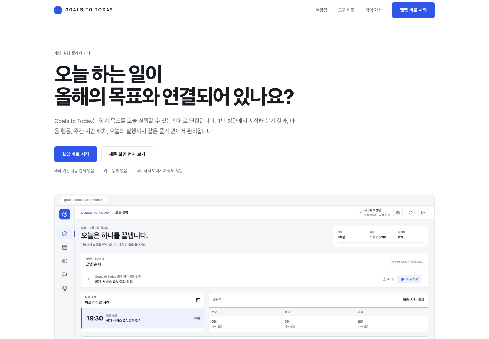
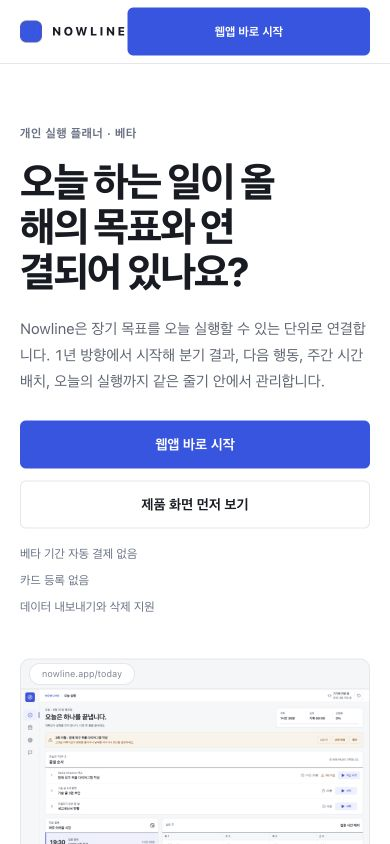
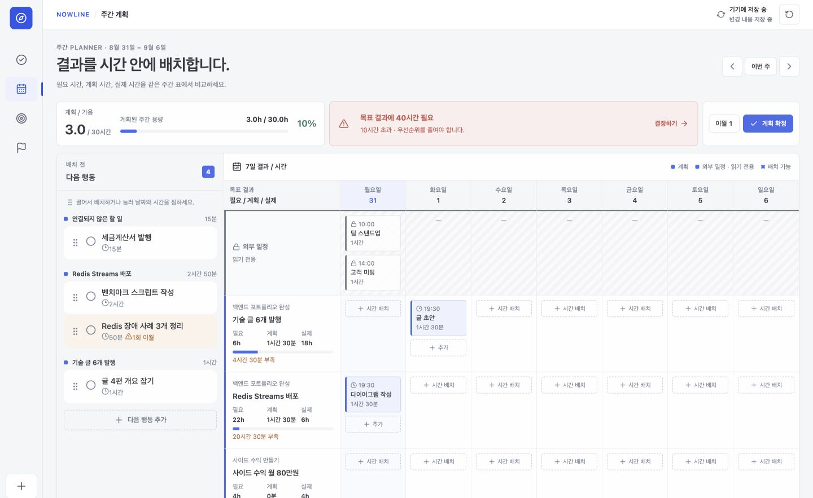
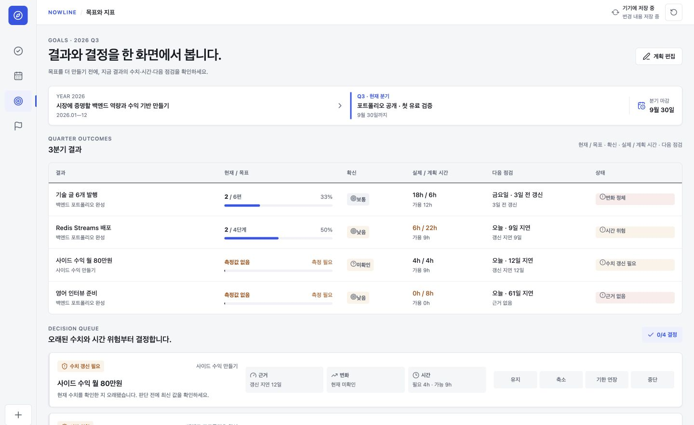
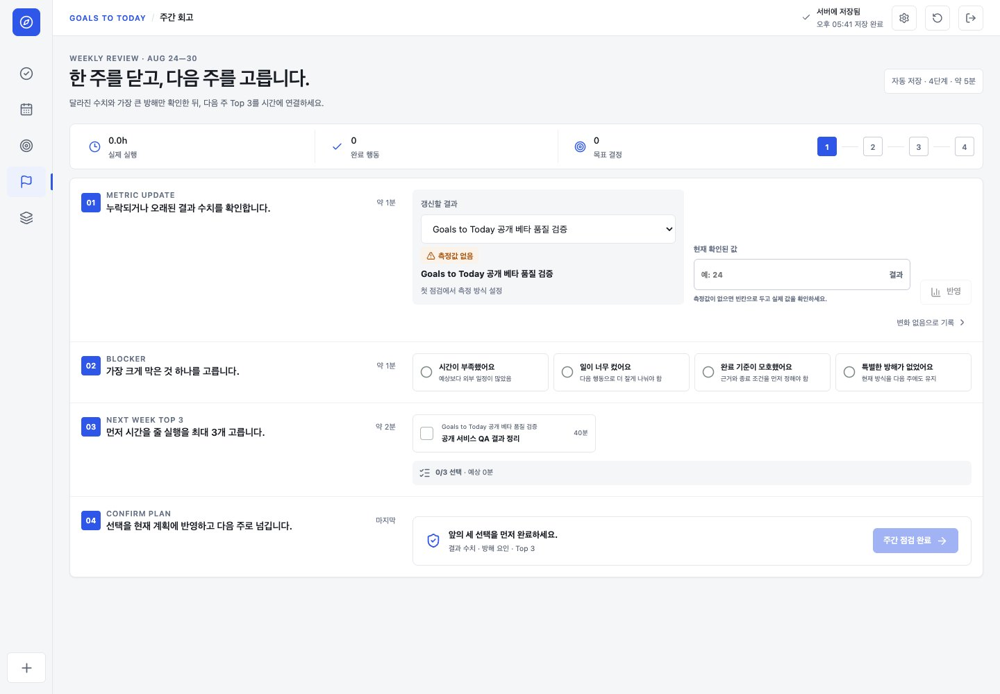
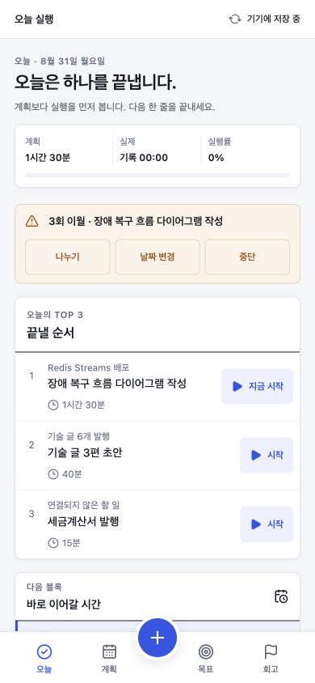
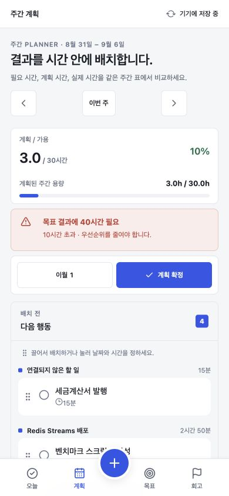
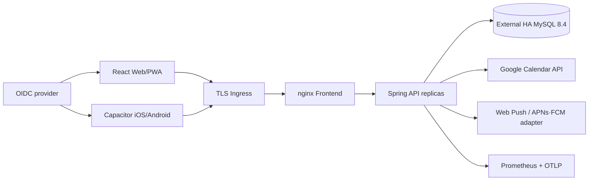

# Goals to Today

연간 방향과 분기 목표를 **측정 가능한 결과 → 다음 행동 → 주간 시간 배치 → 오늘 실행 → 회고**로 연결하는 개인 실행 플래너입니다. 같은 React 코드가 웹/PWA와 Capacitor iOS·Android에서 실행되고, Java 25 Spring API와 MySQL 8.4가 여러 기기의 상태를 동기화합니다.



## 현재 구현 상태

저장소 안의 제품·운영 코드와 로컬 다중 사용자 베타는 구현되어 있습니다. 공개 웹 주소는 [https://goalstotoday.com](https://goalstotoday.com)이며, Mac mini의 Kubernetes 서비스는 Cloudflare Tunnel을 통해서만 노출합니다. 자체 Keycloak 회원가입·OIDC, 무료 베타 권한, MySQL 영속 저장을 사용하며 공용 개발 토큰을 쓰지 않습니다. Google OAuth 게시·검증, 관리형 MySQL HA/PITR, Apple·Google 서명 계정은 각 공급자의 외부 자산이 준비되는 순서대로 연결해야 합니다.

| 영역 | 구현 내용 |
| --- | --- |
| 공개 랜딩 | 비로그인 `/` 제품 소개, 실제 제품 화면, 도구 비교, 무료 베타 안내, `/today` 시작 CTA, 모바일 반응형 |
| 계획 관리 | 여러 연간·분기 계획 생성, 활성화, 종료, 보관, 복원, immutable 변경 이력 |
| 실행 | Today Top 3, 타이머, 수동 시간, 완료 근거, 빠른 수집, 이월 결정 |
| 주간 운영 | 7일 시간 블록, 용량/겹침 방지, 외부 일정, 다음 주 계획 |
| 목표·회고 | 수치 목표, 신뢰도, 계획/실제 시간, 유지·축소·연장·중단 결정 |
| 동기화 | local-first, 오프라인 재시도, ETag, Idempotency-Key, 3-way 충돌 병합 |
| 인증·개인정보 | OIDC Authorization Code + PKCE, JWT tenant 격리, 필수 정책 동의, export, fresh-login 계정 삭제 |
| 베타 권한 | 가입 시 무료 BETA entitlement 자동 부여, 계정별 권한 조회·export·cascade 삭제, 향후 PRO/provider 필드 |
| Google Calendar | 최소 scope OAuth, 암호화 refresh token, 양방향 증분 sync, 410 복구, ETag, webhook watch, 재시도 |
| 알림 | 시간대/quiet hours, Web Push, iOS·Android push adapter, DB job lease, 중복 방지 |
| 운영 | Java 25 virtual threads, rate/body limit, 보안 헤더, Prometheus/OTel, TLS K8s overlay, CI/CD, SBOM·서명·스캔 |

신규 계정은 샘플 목표나 실행 기록을 생성하지 않습니다. 정책 동의 후 onboarding에서 입력한 연간 방향·분기 결과·첫 행동만 서버에 저장됩니다. 기능별 구현·QA 상태와 실제 외부 자산 경계는 [Feature QA matrix](./docs/FEATURE_QA_MATRIX.md)에 정리했습니다.

## 화면

웹의 `/`는 로그인 없이 열리는 공개 랜딩 페이지입니다. 제품의 계획 계층과 실행·회고 흐름을 실제 화면으로 설명하고, `웹앱 바로 시작`을 누르면 `/today`의 인증·온보딩 흐름으로 이동합니다. 네이티브 앱에서는 랜딩을 건너뛰고 바로 제품 화면으로 이동합니다.

<p align="center">
  
</p>



<table>
  <tr>
    <td width="50%"></td>
    <td width="50%"></td>
  </tr>
  <tr>
    <td><strong>Goals</strong><br />성과 수치, 근거 신뢰도, 시간 위험과 다음 결정을 관리합니다.</td>
    <td><strong>Review</strong><br />변화, 방해 요인과 다음 주 Top 3를 실행 계획으로 넘깁니다.</td>
  </tr>
</table>

<p align="center">
  
  
</p>

## 제품 흐름


Goals to Today는 장기 계획을 메모로만 보관하지 않습니다. 목표값·현재값·필요 시간·실제 시간·근거·다음 결정을 함께 저장하고, 계획 상태와 material change를 서버 감사 이력으로 남깁니다.

## 아키텍처



- API는 검증된 JWT의 issuer+subject로 tenant UUID를 계산합니다. 사용자 ID 헤더를 신뢰하지 않습니다.
- 서버 Pod는 세션·job 소유권·planner 상태를 메모리에 두지 않습니다.
- MySQL `SELECT ... FOR UPDATE` 사용자 행 잠금, transient deadlock 3회 재시도, revision과 ETag가 여러 Pod·기기의 동시 쓰기를 통제합니다.
- OAuth/푸시 credential은 AES-256-GCM과 사용자·기기 AAD로 암호화합니다.
- 가상 스레드와 DB pool은 별개이며 기본 Hikari 상한은 Pod당 10개입니다.

## 오늘 실행할 다중 사용자 로컬 베타

필요한 도구는 Node.js 24, Java 25, Docker, 현재 연결된 로컬 Kubernetes입니다. 다음 명령은 자체 Keycloak 회원가입, MySQL, Spring API 2개, React/PWA를 빌드하고 실제 사용자 2명의 가입·데이터 분리·재로그인을 검증한 뒤 `4189` 포트를 계속 열어 둡니다.

```bash
git clone https://github.com/jieseob1/planner.git
cd planner
npm run verify:beta:k8s
npm run k8s:serve:status
```

- 사용자 앱: [http://localhost:4189](http://localhost:4189)
- 종료: `npm run k8s:serve:stop` 후 `npm run k8s:down`
- 데이터: MySQL PVC는 workload를 내려도 유지됩니다.
- 베타 결제: 현재는 모든 신규 계정에 무료 BETA 권한만 부여하며 자동 결제하지 않습니다.

Docker Compose만 사용할 때는 `npm run beta:up`, `npm run verify:beta:runtime`, `npm run beta:backup` 순서로 실행하고 [http://localhost:8088](http://localhost:8088)에 접속합니다. 자세한 운영·백업·AWS 이전 절차는 [Local beta runbook](./docs/LOCAL_BETA_RUNBOOK.md)에 있습니다.

외부 사용자는 [https://goalstotoday.com](https://goalstotoday.com)으로 접속합니다. `127.0.0.1:4189`는 Goals to Today 전용 Cloudflare Tunnel의 origin으로만 사용하며 라우터 포트나 Kubernetes Service를 인터넷에 직접 열지 않습니다. 기존 Mac mini SSH 터널은 별도 tunnel이라 웹 배포·재시작의 영향을 받지 않습니다.

## 5분 단일 사용자 개발 실행

필요한 도구는 Node.js 24, Java 25, Docker입니다.

```bash
git clone https://github.com/jieseob1/planner.git
cd planner
npm ci
make compose-up
make compose-verify
```

- 앱: [http://localhost:8088](http://localhost:8088)
- readiness: [http://localhost:8080/actuator/health/readiness](http://localhost:8080/actuator/health/readiness)
- metrics: [http://localhost:8080/actuator/prometheus](http://localhost:8080/actuator/prometheus)

이 개발용 Compose는 외부에 노출하면 안 되는 `local-auth` profile과 로컬 전용 JWT secret을 사용합니다. 실제 사용자 베타에는 위의 `beta:*` 또는 `verify:beta:k8s` 명령만 사용합니다. 종료해도 MySQL volume은 보존됩니다.

```bash
make compose-logs
make compose-down
```

Vite HMR 개발은 MySQL/backend만 Compose로 실행한 다음 `npm run dev`를 사용합니다.

```bash
make backend-jar
docker compose up -d mysql backend
npm run dev
```

## 웹·앱 인증 설정

기본 예시는 [.env.example](./.env.example)에 있습니다.

```dotenv
VITE_AUTH_MODE=oidc
VITE_OIDC_AUTHORITY=https://goalstotoday.com/idp/realms/nowline
VITE_OIDC_CLIENT_ID=nowline-public-client
VITE_OIDC_WEB_REDIRECT_URI=https://goalstotoday.com/auth/callback
VITE_OIDC_NATIVE_REDIRECT_URI=com.jieseob.planner://auth/callback
```

네이티브 빌드는 Vite proxy를 쓸 수 없으므로 `VITE_API_BASE_URL`에 기기에서 접근 가능한 HTTPS origin을 넣습니다. localhost 자동 local-auth는 웹 개발에서만 동작하며, 네이티브는 명시적으로 local mode를 빌드하지 않는 한 OIDC를 사용합니다.

```bash
npm run cap:sync
npm run app:ios
npm run app:android
```

## 로컬 Kubernetes

현재 `kubectl` context를 그대로 사용하며 클러스터를 만들거나 바꾸지 않습니다.

```bash
npm run k8s:up
npm run k8s:verify
npm run verify:k8s:runtime
npm run verify:beta:k8s
```

local overlay는 MySQL PVC, MySQL-backed Keycloak, backend 2 replicas, HPA 2~6, PDB, startup/readiness/liveness probe와 topology spread를 포함합니다. `verify:beta:k8s`는 다중 사용자 브라우저 QA 후 로컬 포트포워드를 유지합니다. production overlay는 로컬 DB를 제거하고 TLS Ingress, default-deny NetworkPolicy, 전용 ServiceAccount, 외부 Secret/HA DB, migration Job, ServiceMonitor와 alerts 계약을 사용합니다.

## 검증

```bash
npm run verify:production # 아래 전체 검증 + migration runner + 복구 + 계약 + dependency audit
npm run verify:full       # React + PWA/mobile sync + Spring/Testcontainers + manifests + HTTP E2E
npm run verify:production:e2e # 실제 Chrome에서 인증·오프라인·충돌·Google·탈퇴 흐름 검증
npm run verify:production:reliability # backend 2대 부하·soak·failover·quota retry 검증
npm run verify:migration  # 운영과 같은 one-shot Flyway runner가 V8 적용 후 정상 종료
npm run verify:recovery   # MySQL 8.4 mysqldump/restore 무결성 drill
npm run verify:k8s:runtime # 현재 이미지를 local cluster에 넣고 두 Pod 동시성 검증
npm run verify:mysql-contract # production 코드·설정·테스트의 PostgreSQL 의존성 부재 검사
npm run verify:secrets    # Git 추적 파일의 private key/provider token signature 검사
npm run verify:beta       # 로컬 다중 사용자 베타 구현 전체 검증
npm run verify:beta:runtime # Compose에서 회원가입·tenant 격리·재로그인 검증
npm run verify:beta:backup  # 실제 무중단 MySQL dump·gzip·checksum 검증
npm run verify:beta:k8s     # 로컬 K8s 배포·동일 사용자 흐름·2 backend Ready 검증
npm run verify:goalstotoday:contracts # 새 브랜드·도메인·배포 계약 검증
npm run verify:goalstotoday:public    # 공개 HTTPS·OIDC·SSH·데스크톱/모바일 smoke 검증
npm run verify:goalstotoday:deployment # 로컬·GitHub·Mac mini revision 일치 검증
```

`verify:k8s:runtime`은 현재 Kubernetes context를 바꾸지 않으며, local overlay와 현재 이미지를 적용합니다. 두 backend Pod에 직접 동시 요청해 하나만 ETag update에 성공하고 최종 상태가 일치하는지 확인합니다.

`verify:production:e2e`와 `verify:production:reliability`는 매 실행마다 격리된 MySQL 8.4·backend·가짜 Google Calendar 공급자를 만들고 종료합니다. 전자는 데스크톱/모바일 인증 사용자 여정과 실제 PUT 저장, 키보드 조작, 200% 확대 핵심 모달, focus trap·복귀, light-only/reduced-motion을 Chrome으로 확인합니다. 후자는 두 backend 인스턴스의 부하·30초 soak·동시 수정·단일 인스턴스 중단·Google 429 재시도를 확인합니다. 기준과 최근 측정값은 [Reliability baseline](./docs/RELIABILITY_BASELINE.md)에 있습니다.

이전 로컬 PostgreSQL 데이터는 삭제하지 않습니다. Compose volume과 Kubernetes PVC를 각각 custom-format dump로 보존한 뒤, 비어 있는 MySQL에 [one-time migration tool](./scripts/legacy-data-migration/README.md)로 이관하고 테이블별 건수와 planner 지문을 대조합니다. 검증 후에는 PostgreSQL workload만 내리고 원본 volume/PVC와 dump는 복구용으로 유지합니다.

Android debug APK는 JDK 21과 Gradle 8.13으로 `assembleDebug`까지 확인했습니다. iOS 프로젝트와 자산은 Capacitor sync 및 CI release workflow에 포함되며, 로컬 서명 없는 simulator/archive 검증에는 전체 Xcode 설치가 필요합니다.

CI는 PR마다 프론트/백엔드/E2E/CodeQL을 수행합니다. release workflow는 두 이미지를 SBOM·provenance와 함께 빌드하고, HIGH/CRITICAL scan, keyless cosign 서명, migration Job, digest 고정 rollout을 수행합니다.

## 공개 배포 전에 반드시 필요한 것

아래 항목은 저장소에서 대신 발급하거나 승인할 수 없습니다.

- Cloudflare 계정·Tunnel과 `goalstotoday.com` DNS/TLS 운영 권한
- Keycloak 운영 admin 복구·백업과 테스트 계정
- Google Cloud OAuth client, 검증된 domain, 동의 화면 게시/검증
- 관리형 MySQL 8.4의 HA, 자동 backup, PITR와 실제 복구 증거
- Secret Manager, OTLP collector, Prometheus alert 수신 채널
- VAPID와 APNs/FCM adapter credential
- Apple Developer/Google Play 계정, signing key, physical-device와 store 심사
- 운영 주체의 개인정보 보관기간·연락처·약관 법률 검토

설정 순서와 값은 [Production setup](./docs/PRODUCTION_SETUP.md), 장애·복구 절차는 [Operations runbook](./docs/OPERATIONS_RUNBOOK.md), 앱 출시는 [Mobile release checklist](./docs/MOBILE_RELEASE.md)에 있습니다.

## 프로젝트 구조

```text
planner/
├── src/                         React 화면, 인증, 상태, API clients
├── backend/                     Java 25 Spring API, Flyway, 통합 테스트
├── infra/k8s/base/              공통 Deployment/Service/HPA/PDB
├── infra/k8s/overlays/local/    로컬 DB 포함 개발 runtime
├── infra/k8s/overlays/production/ TLS/보안/관측/외부 DB 계약
├── android/ · ios/              Capacitor native projects
├── scripts/                     build, E2E, scale-out, recovery verifiers
├── docs/                        운영·설계·사용성 문서와 screenshots
└── .github/workflows/           CI, CodeQL, container/mobile release
```

## 기술 스택

| 구분 | 기술 |
| --- | --- |
| Frontend | React 19, TypeScript 7, React Router 7, Vite 8, Vitest 4 |
| Web/App | PWA/Workbox, Capacitor 8, iOS, Android, secure storage |
| Backend | Java 25, Spring Boot 4.1.1, Spring MVC virtual threads, JDBC/Flyway |
| Data | MySQL 8.4 LTS, InnoDB, normalized planner schema, audit/job/lease tables |
| Security | OAuth2 Resource Server, OIDC PKCE, AES-GCM, rate/body limits, CSP/HSTS |
| Operations | Kubernetes/Kustomize, Prometheus, OpenTelemetry, GitHub Actions, Cosign, Trivy |

## 문서

- [Production setup](./docs/PRODUCTION_SETUP.md)
- [Local beta runbook](./docs/LOCAL_BETA_RUNBOOK.md)
- [Operations runbook](./docs/OPERATIONS_RUNBOOK.md)
- [Mobile release checklist](./docs/MOBILE_RELEASE.md)
- [Backend architecture](./docs/BACKEND_ARCHITECTURE.md)
- [Backend API](./backend/README.md)
- [Compose/Kubernetes](./infra/README.md)
- [Design spec](./DESIGN_SPEC.md)
- [Production UX audit](./docs/PRODUCTION_UX_AUDIT.md) · [usability sources](./docs/USABILITY_REFERENCES.md)
- [Reliability baseline](./docs/RELIABILITY_BASELINE.md)
- [Feature QA matrix](./docs/FEATURE_QA_MATRIX.md)
- [Acceptance gates](./GATES.md)
- [Claude Design source](https://claude.ai/design/p/97a88bc6-c95f-4bc3-9e8f-ed453200caef?file=Planner_HighFidelity.dc.html)
