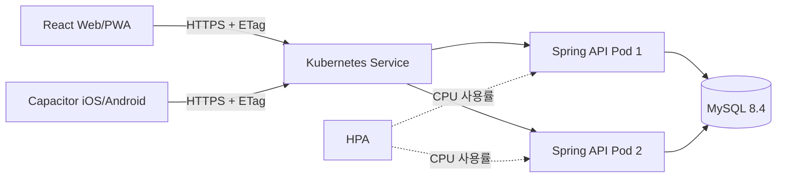
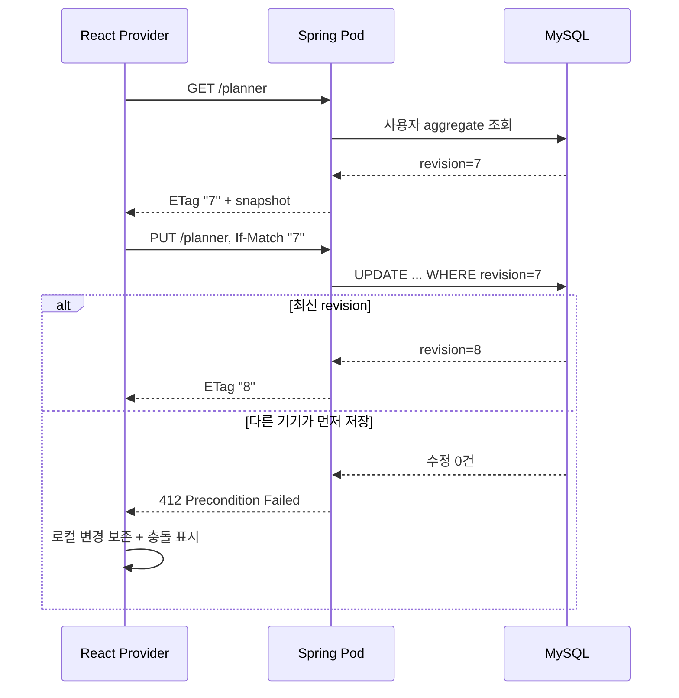

# Nowline 백엔드 아키텍처

## 결론

Nowline 백엔드는 **상태 없는 Spring Boot API Pod + MySQL 8.4 InnoDB 단일 진실 공급원**으로 구성합니다. 웹/PWA/Capacitor 앱은 같은 API 계약을 사용하고, 로컬 저장소는 오프라인 캐시로만 남깁니다. 여러 Pod가 동시에 요청을 받아도 사용자 행 잠금, bounded deadlock retry, `revision`과 `ETag`가 이전 데이터를 조용히 덮어쓰는 일을 막습니다.

## 선택한 기준

| 관심사 | 구현 결정 | 이유 |
| --- | --- | --- |
| Java | Java 25 | 요청 조건을 그대로 사용하고 최신 가상 스레드 런타임을 활용 |
| 웹 스택 | Spring MVC + JDBC | 현재 API는 MySQL I/O 중심이며 가상 스레드와 단순하게 결합 |
| 동시성 | `spring.threads.virtual.enabled=true` | 요청별 플랫폼 스레드 점유를 줄임 |
| DB 보호 | 제한된 HikariCP 풀 | 가상 스레드 수와 DB 동시 연결 수를 분리해 과부하를 제한 |
| 영속화 | Flyway로 관리하는 정규화 MySQL/InnoDB 스키마 | 목표·작업·시간·회고 데이터를 추후 조회·분석할 수 있게 유지 |
| 스케일 아웃 | 서버 세션과 로컬 메모리 상태 없음 | 어느 Pod가 요청을 받아도 같은 결과를 반환 |
| 동시 수정 | aggregate `revision`, `ETag`, `If-Match` | 여러 기기의 오래된 저장이 새 데이터를 덮어쓰는 것을 차단 |
| 재시도 | `Idempotency-Key` | 모바일 네트워크 재시도로 같은 쓰기가 중복 처리되는 것을 차단 |
| 배포 | Kustomize + 2개 API 복제본 + HPA/PDB | 로컬에서 운영 형태를 작게 재현하고 수평 확장 경계를 검증 |

Spring Boot 4.1.1은 Java 26까지 호환되므로 Java 25가 공식 지원 범위에 들어갑니다. Spring Boot는 Java 21 이상에서 `spring.threads.virtual.enabled=true`로 가상 스레드 기반 실행기를 구성합니다. 참고: [Spring Boot 시스템 요구사항](https://docs.spring.io/spring-boot/system-requirements.html), [Task execution and scheduling](https://docs.spring.io/spring-boot/reference/features/task-execution-and-scheduling.html).

## API 계약

공개 API 중 `/api/v1/**`의 개인정보 경로는 Spring Security Resource Server가 검증한 Bearer JWT를 사용합니다. 서버는 `issuer + subject`로 tenant UUID를 계산하며 클라이언트가 보낸 사용자 ID 헤더를 신뢰하지 않습니다. Compose의 `local-auth` profile만 로컬 개발용 토큰 발급 경로를 제공하고, production profile에서는 비활성화됩니다.

| 메서드 | 경로 | 동시성 조건 | 결과 |
| --- | --- | --- | --- |
| `GET` | `/api/v1/planner` | 없음 | `{ revision, snapshot }`와 `ETag`; 아직 없으면 404 |
| `PUT` | `/api/v1/planner` | 최초 `If-None-Match: *`, 이후 `If-Match: "revision"` | 전체 스냅샷을 한 트랜잭션으로 생성/교체 |
| `DELETE` | `/api/v1/planner` | `If-Match: "revision"` | 해당 사용자 Planner만 제거 |

`PlannerSnapshot`의 필드 이름과 enum 값은 프론트엔드 TypeScript 타입을 그대로 사용합니다. 잘못된 참조, 음수 시간, 범위를 벗어난 시간 블록, 겹치는 시간 블록은 400으로 거절합니다. 오래된 revision은 412, 같은 idempotency key를 다른 요청 내용에 재사용하면 409 Problem Details를 반환합니다.

## 저장과 충돌 흐름

프론트엔드는 화면 시작 시 `localStorage`를 먼저 보여 주고 서버 응답을 기다립니다. 네트워크가 끊기면 로컬 변경을 유지하며, 다시 연결되면 마지막으로 확인한 revision으로 저장을 재시도합니다. 412 응답에서는 서버 데이터를 자동으로 덮어써 로컬 변경을 잃게 하지 않습니다.

## Kubernetes에서의 확장 경계

- Backend Deployment는 기본 2 replicas이고 RollingUpdate 중 가용 Pod를 유지합니다.
- readiness/liveness/startup probe는 Spring Boot Actuator의 전용 상태를 사용합니다. Spring 문서는 `/actuator/health/liveness`와 `/actuator/health/readiness`를 Kubernetes probe에 연결하도록 안내합니다: [Spring Boot Actuator Kubernetes probes](https://docs.spring.io/spring-boot/reference/actuator/endpoints.html#actuator.endpoints.kubernetes-probes).
- HPA는 `autoscaling/v2`와 CPU request를 기준으로 동작합니다. Metrics Server가 별도 필요합니다: [Kubernetes HPA](https://kubernetes.io/docs/concepts/workloads/autoscaling/horizontal-pod-autoscale/).
- PDB는 자발적 축출 시 API 가용 인스턴스를 남기며, topology spread는 여러 노드가 있을 때 Pod를 분산합니다: [Pod disruptions](https://kubernetes.io/docs/concepts/workloads/pods/disruptions/), [Topology spread](https://kubernetes.io/docs/concepts/scheduling-eviction/topology-spread-constraints/).
- MySQL은 로컬 개발 편의를 위한 단일 StatefulSet입니다. 운영 환경에서는 관리형 MySQL 8.4, 백업, PITR, 연결 프록시를 별도 설계해야 합니다.

## 운영 보안 경계

- OIDC Authorization Code + PKCE 로그인과 JWT issuer/audience/time 검증이 production 기본값입니다.
- CORS는 설정된 HTTPS origin만 허용하고, TLS Ingress와 외부 Secret을 production overlay에서 강제합니다.
- refresh token과 push credential은 AES-256-GCM으로 암호화하며 키는 저장소 밖 Secret Manager가 공급합니다.
- 로컬 MySQL StatefulSet은 개발 전용입니다. production overlay는 관리형 HA MySQL 8.4, 자동 백업과 PITR을 외부 계약으로 요구합니다.
- Hikari pool, Pod request/limit와 HPA 기준은 로컬 부하·scale-out 검증값을 기본선으로 두되 실제 staging 관측 후 조정해야 합니다.

외부 자산이 필요한 최종 공개 승인 항목은 `docs/FEATURE_QA_MATRIX.md`와 `GATES.md`의 G41~G43에서 별도로 추적합니다.
