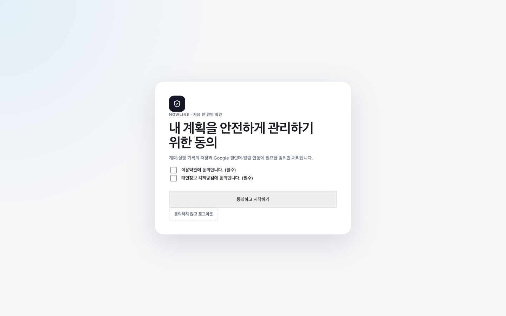
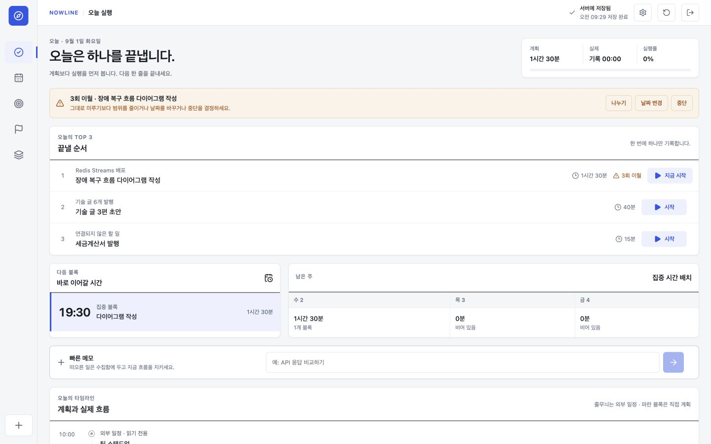
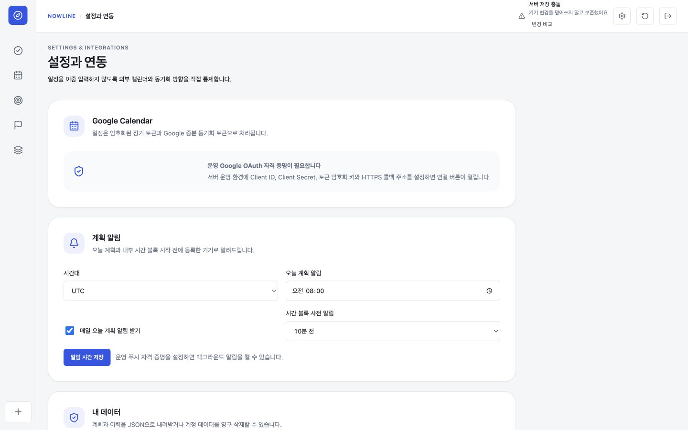
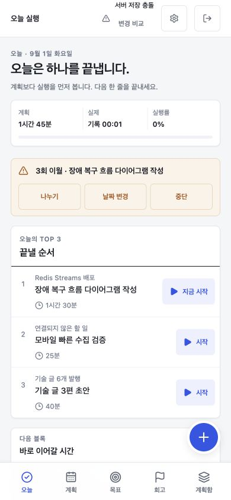
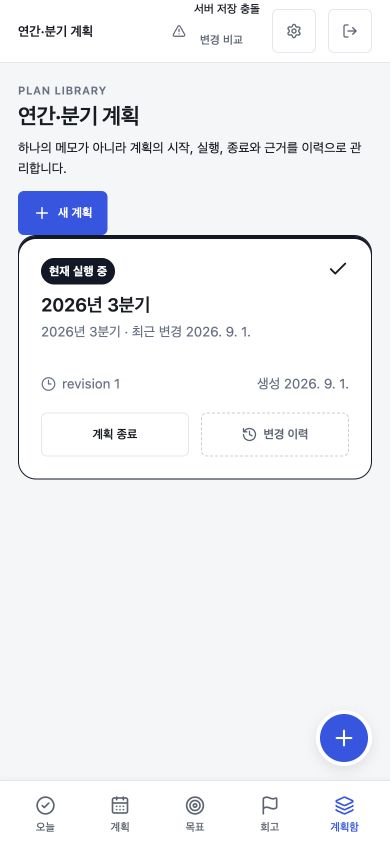
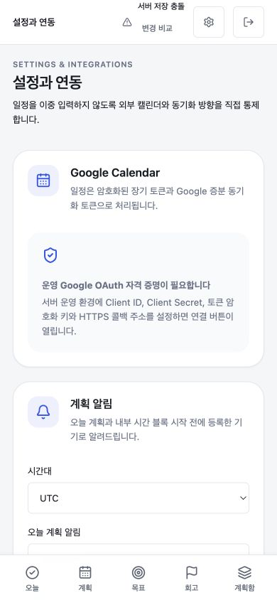

# Production UX and accessibility audit

점검일: 2026-09-01  
범위: 최초 정책 동의 → Today 실행 → 설정/연동 → 연간·분기 계획함 → 새 계획 작성  
화면: 1440×900 desktop, 390×844 mobile

## 결론

핵심 실행 흐름과 계획 상태는 데스크톱·모바일에서 명확하며 가로 overflow가 없었습니다. 이번 점검에서 발견한 모바일 하단 내비게이션 2행 배치, floating capture가 설정 입력을 가리는 문제, 설정/새 계획 form의 약한 입력 affordance를 수정했습니다. 정책 동의는 독립된 공개 화면과 필수 checkbox, 거부/logout 경로가 있으며 폭과 한국어 줄바꿈을 보완했습니다.

## 단계별 증거

### 1. 최초 정책 동의 — 양호

- 필수 두 항목이 분리되고 원문 링크와 동의하지 않을 경로가 보입니다.
- CTA는 두 항목을 모두 선택하기 전 disabled입니다.
- 560px 카드와 `word-break: keep-all`로 한국어 제목의 부자연스러운 단어 절단을 줄였습니다.

### 2. Today 데스크톱 — 양호

- 첫 화면에서 오늘 Top 3, 이월 경고, 다음 시간 블록, 주간 잔여 용량이 순서대로 보입니다.
- 서버 저장 상태가 global header에 있고, 이월 경고에 나누기·날짜 변경·중단이라는 복구 행동이 있습니다.
- viewport 기준 horizontal overflow는 0이었습니다.

### 3. 설정과 연동 데스크톱 — 양호, 외부 검증 필요

- Google 자격 증명이 없을 때 빈 연결 버튼 대신 필요한 운영 조건을 설명합니다.
- 알림 시간대/시각/사전 알림과 데이터 export/delete가 영역별로 분리됩니다.
- form을 2열 grid와 동일한 input surface로 정리하고 시간대를 IANA 선택 목록으로 바꿨습니다.
- 실제 Google OAuth, Web Push, APNs/FCM 성공·오류 상태는 운영 credential 없이는 확인할 수 없습니다.

### 4. Today 모바일 — 양호

- 390px에서 Top 3와 이월 결정을 먼저 보여주고 문서 overflow는 0입니다.
- 다섯 개 내비게이션이 한 줄에 유지되며 각 항목은 약 75×57 CSS px입니다.
- 빠른 수집 FAB는 하단 내비게이션과 분리해 콘텐츠와 내비게이션 항목을 가리지 않습니다.

### 5. 연간·분기 계획함 모바일 — 양호

- 현재 실행 중 상태, 기간, revision, 생성일, 종료와 이력 행동이 한 카드에 모입니다.
- active plan을 종료하면 다른 plan을 활성화할 때까지 실행 화면으로 자동 진입하지 않도록 route guard를 적용했습니다.
- 계획함/설정에서는 불필요한 빠른 수집 FAB를 숨겨 주요 행동과 겹치지 않습니다.

### 6. 새 연간·분기 계획 모바일 — 양호

- bottom sheet에서 이름, 연도, 분기, 1년 방향, 분기 결과가 논리 순서대로 배치됩니다.
- input/select는 모바일에서 최소 44px이고 textarea는 충분한 작성 공간을 제공합니다.
- 필수 분기 결과가 비어 있으면 초안 만들기가 disabled입니다.

### 7. 설정 모바일 — 양호

- card가 한 열로 재배치되고 문서 overflow는 0입니다.
- input/select는 44px, mobile navigation은 한 줄입니다.
- 점검 중 FAB가 시간대 field를 가리던 문제를 확인해 설정/계획함에서 제거했습니다.

## 남은 검증 한계

- 자동 브라우저 QA는 skip link, 빠른 수집, 새 계획 initial focus, modal focus trap·복귀, 주요 화면의 visible control label, 44px target과 200% zoom 등가 6개 route의 overflow를 검증합니다.
- 이 자동화만으로 screen reader announcement, iOS VoiceOver, Android TalkBack, OS 큰 글자 설정과 200% zoom에서 모든 modal의 시각적 준수를 확정할 수 없습니다.
- OIDC 공급자 오류, 실제 Google quota/reauthorize, browser permission denial, APNs/FCM delivery와 store review는 외부 환경에서 실증해야 합니다.
- 정책 문안은 기능 구현과 데이터 경계를 반영했지만 실제 운영 주체의 법률 검토가 필요합니다.

## 공개 전 수동 접근성 체크

- [x] 자동 브라우저에서 skip link, 빠른 수집, 새 계획 focus, 삭제 modal focus trap·Escape·trigger focus 복귀 확인
- [ ] 키보드만으로 동의, Today 전체 실행, 충돌 병합과 설정 전체 여정 수동 확인
- [ ] VoiceOver/TalkBack에서 저장·충돌·동기화 상태 변경 announcement 확인
- [x] 200% browser zoom 등가 720×450 CSS viewport의 6개 주요 route에서 horizontal overflow 없음
- [ ] 200% browser zoom과 OS 큰 글자 설정에서 모든 modal footer/하단 navigation 가림 없음
- [ ] light/dark system contrast와 reduced motion 확인
- [ ] 실제 permission denied/expired session/Google reconnect 오류의 focus 이동과 복구 문구 확인
