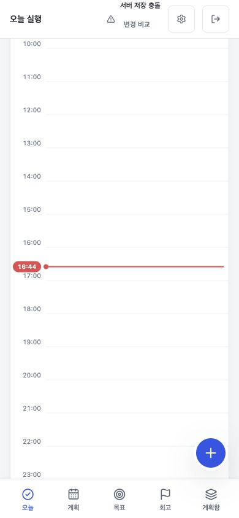
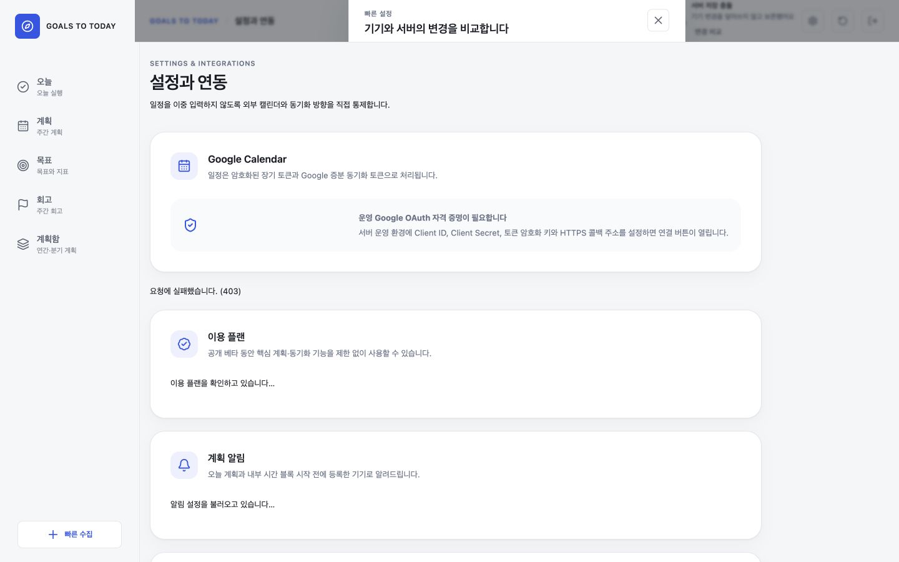
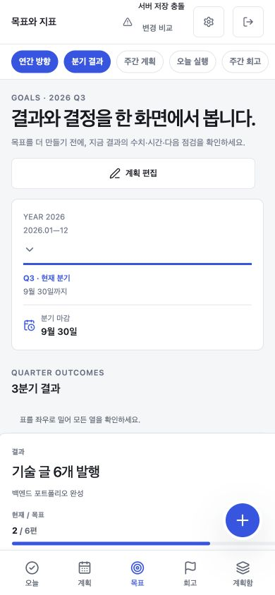
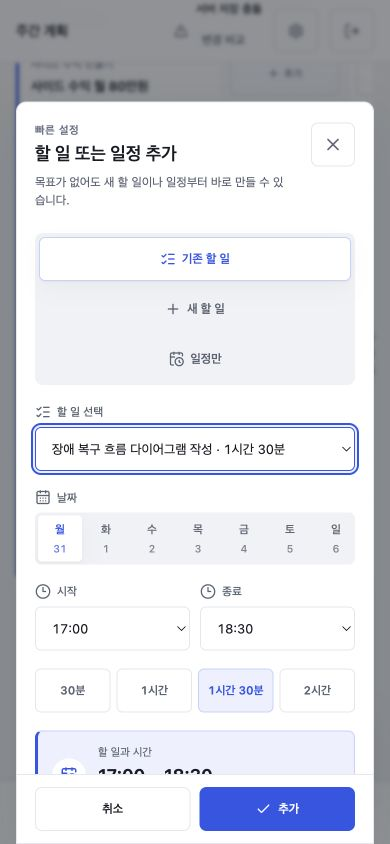
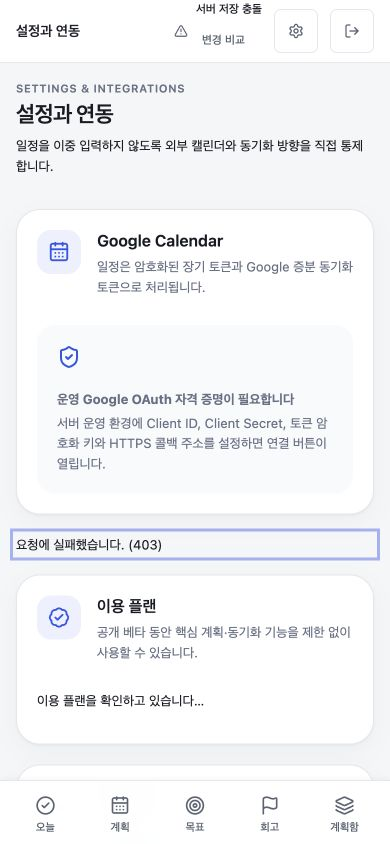
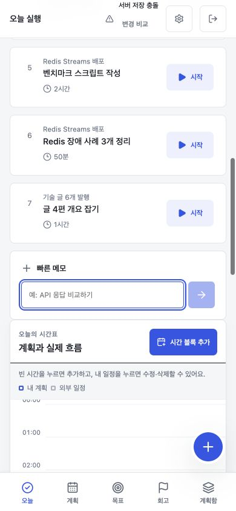

# Goals to Today 레드팀 사용성 감사 결과

- 실행일: 2026-09-02 (Asia/Seoul)
- 대상: 로컬 로그인 상태 `http://localhost:4173`
- 화면: 데스크톱 1440×900, 모바일 390×844
- 방법: 실제 UI 순회, 비파괴 대화상자 조작, DOM·레이아웃 측정, 기존 자동 검증 실행, 코드 흐름 교차 점검
- 기준: [Nielsen의 사용성 휴리스틱](https://www.nngroup.com/articles/ten-usability-heuristics/), [WCAG 1.4.10 Reflow](https://www.w3.org/WAI/WCAG21/Understanding/reflow), [WCAG 2.5.8 Target Size](https://www.w3.org/WAI/WCAG22/Understanding/target-size-minimum)

## 결론

Todo와 일정의 기본 조작은 구현되어 있다. 00:00~24:00 빈 칸 추가, 기존 Todo 배치, 목표 없는 새 Todo, 독립 일정, 기존 일정 수정·삭제, 현재 시각 선을 실제 화면에서 확인했다.

그러나 공개 베타의 데이터 안전성과 반복 사용을 막는 위험이 남아 있다. 코드 흐름상 계정 전환 시 로컬 스냅샷과 revision 기반 ETag가 다른 사용자에게 재사용될 가능성, `day + weekOffset` 일정이 주 경계에서 잘못 재등장할 가능성이 가장 크다. 실제 UI에서는 저장 충돌 복구창이 상단바 안에 잘려 병합할 수 없고, 모바일 Goals가 888px까지 넓어지며, Review의 `다음 주로`가 현재 주 월요일을 연다.

현재 판정은 **공개 베타 배포 전 P0 2건과 P1 핵심 흐름을 먼저 수정해야 함**이다.

## 자동 검증 결과

| 검증 | 결과 | 해석 |
|---|---:|---|
| `npm run verify:release` | PASS | 6개 테스트 파일, 39개 테스트, 빌드, 정적 사용성 검사, Capacitor sync 통과 |
| `npm run verify:e2e` | PASS | MySQL과 Spring 기반 백엔드 API E2E 통과 |
| `npm run verify:production:e2e` | FAIL | 첫 화면에서 동의 제목을 30초 동안 찾지 못함 |

운영 브라우저 E2E는 `/`로 이동한 직후 동의 화면을 기대하지만 현재 `/`는 랜딩 페이지다. 따라서 넓어 보이는 기존 자동화 범위가 실제로는 시작조차 못하며, 표준 CI도 이 명령을 게이트로 실행하지 않는다. 정적·단위 검증 통과를 실제 사용자 흐름 통과로 해석하면 안 된다.

## 잘 구현된 핵심

| 항목 | 실제 확인 |
|---|---|
| 자유로운 입력 | 시간 블록에서 `기존 할 일`, `새 할 일`, `일정만` 세 방식을 선택 가능 |
| 목표 선택성 | 새 할 일은 `연결하지 않음`을 지원 |
| 하루 시간표 | 00:00~24:00, 모든 1시간 빈 칸이 버튼으로 노출 |
| 세밀한 시간 | 편집기에서 30분 단위 시작·종료와 빠른 시간 선택 지원 |
| 수정·삭제 | 기존 일정에 `일정에서 삭제`가 있고 연결 Todo 유지 문구 제공 |
| 현재 시각 | 모바일에서 16:44 빨간 선과 라벨을 실제 확인 |
| 빠른 수집 | 모바일 중앙 `+`가 Today의 빠른 메모로 이동하고 포커스 제공 |
| 기본 접근성 | 본문 건너뛰기, 역할·이름, 대화상자 포커스 구조가 존재 |

## 우선순위별 발견 사항

### P0 — 계정 전환 시 로컬 데이터가 다른 계정에 섞일 수 있음

- 증거 수준: 코드 흐름 확인, 실제 두 계정 파괴적 재현은 미수행
- 재현 후보: A 계정에서 로컬 계획 보유 → 로그아웃 → 같은 브라우저에서 빈 B 계정 로그인
- 실제 구현: planner·sync·충돌 localStorage 키가 사용자별이 아니며 로그아웃이 이를 지우지 않는다. B 서버가 404면 기존 로컬 계획을 B의 미동기화 계획으로 판단해 업로드할 수 있다.
- 추가 위험: HTTP ETag가 사용자나 내용 해시 없이 revision 숫자로 만들어진다. A와 B의 revision이 같으면 B 조회가 304로 처리되어 A의 로컬 스냅샷을 최신으로 오인할 수 있다.
- 기대: 인증 주체별 저장소 namespace, 사용자 변경 감지, 다른 주체의 캐시·ETag 무효화.
- 권장 검증: `RED_TEAM_SCENARIOS.md` RT-14.

### P0 — 일정이 절대 날짜가 없어 주마다 재등장하거나 계속 미래로 밀릴 수 있음

- 증거 수준: 프론트·백엔드 코드 흐름 확인, 시간 이동 E2E 미수행
- 실제 구현: 내부 시간 블록은 `day`와 상대 `weekOffset`만 저장한다. 주 경계 rollover가 없고 알림도 `weekOffset=0 + 오늘 요일`이면 현재 날짜의 블록으로 취급한다.
- 영향: 단발 일정이 같은 요일에 다시 나타나고 재알림될 수 있다. `weekOffset=1` 일정은 다음 주가 되어도 계속 상대적 다음 주에 남을 수 있다.
- 기대: ISO 현지 날짜 또는 UTC instant를 저장하고 시간대 변경·DST·주 경계 테스트를 둔다.
- 권장 검증: RT-15.

### P1 — 저장 충돌 비교창 본문이 보이지 않아 복구 불가

- 실제 재현: Settings에서 `변경 비교` 클릭.
- 결과: 접근성 트리에는 항목별 선택과 병합 버튼이 있었지만 화면에는 대화상자 헤더만 보였다.
- 측정: 대화상자는 높이 693px이지만 부모 backdrop의 실제 높이는 상단바와 같은 약 67px이었다.
- 원인 후보: `SaveStatus`가 `top-bar__actions` 내부에서 대화상자를 렌더링하고, 상단바의 `backdrop-filter`가 fixed 요소의 containing block을 만든다.
- 기대: body portal에서 렌더링하고 모든 viewport에서 전체 본문과 액션이 보인다.

### P1 — 모바일 Goals가 페이지 전체를 888px로 확장

- 실제 재현: 390×844에서 Goals 진입.
- 측정: `clientWidth=390`, `document.scrollWidth=888`; 결과 표의 폭은 약 890px.
- 영향: 지표·상태가 오른쪽에 잘리고 페이지 자체가 좌우로 움직인다. 표 내부만 스크롤된다는 안내와 실제 동작이 다르다.
- 기대: 모바일 카드가 단일 열로 재배치되거나, 고정 폭 표는 폭이 제한된 전용 스크롤 컨테이너 안에만 둔다.

### P1 — Planner가 실제 오늘이 아닌 월요일을 강조

- 실제 재현: 2026-09-02 수요일에 Planner 진입.
- 결과: `월요일 31` 헤더에 `is-today`와 파란 배경이 적용되고 `수요일 2`는 일반 상태였다.
- 기대: 현재 주의 실제 현지 날짜만 강조하고 이전·다음 주에는 강조하지 않는다.

### P1 — Review의 `다음 주로`가 현재 주 월요일을 엶

- 실제 재현: Review의 첫 이월 작업에서 `다음 주로` 클릭.
- 결과: 기간은 현재 주 `8월 31일~9월 6일`, 선택일은 `월 31`, 시작은 17:00이었다.
- 기대: 다음 주 기간으로 이동하고 실제 다음 주 날짜를 선택한다.

### P1 — 6번째 이후 Todo를 회고 Top 3로 선택할 수 없음

- 실제 재현: 활성 작업 7개인 데이터로 Review 확인.
- 결과: Top 3 후보는 앞의 5개만 노출되어 6·7번째 작업이 없었다.
- 코드 흐름: 후보 배열이 `activeTasks.slice(0, 5)`로 제한된다.
- 기대: 전체 활성 작업 검색·필터 또는 페이지네이션.

### P1 — Settings 일부 API 실패가 전체 카드의 무한 로딩으로 남음

- 실제 재현: Settings 진입.
- 결과: `요청에 실패했습니다. (403)`과 `이용 플랜을 확인하고 있습니다…`, `알림 설정을 불러오고 있습니다…`가 동시에 계속 보였다.
- 영향: 어느 요청이 실패했는지, 재로그인이 필요한지, 다시 시도할 수 있는지 알 수 없다. Google Calendar도 운영 OAuth 자격 증명이 없어 연결할 수 없다.
- 기대: 카드별 독립 로딩·오류·재시도와 401/403 재인증 안내.

### P1 — 결과 추가·삭제와 실제 지표 관리가 부족

- 증거 수준: UI·코드 흐름 확인
- 결과: Goals의 계획 편집은 기존 결과 하나를 선택해 이름·목표·필요·가용 시간만 수정한다. 결과 추가·삭제, 단위, 현재값, 근거, 다음 점검일 관리가 없다.
- 영향: 1년·분기 계획을 메모가 아니라 관리 대상으로 쓰려는 핵심 요구를 충족하지 못한다.
- 기대: 결과 CRUD, 지표 이력, 근거 링크·메모, 점검 주기·담당 상태.

### P1 — 기대 화면의 풍부한 상태가 실제 사용으로 만들어지지 않음

- 증거 수준: 상태 갱신 코드와 데모 데이터 교차 점검
- 결과: 실제 사용자가 타이머를 기록해도 `timeEntries`만 늘고 결과의 `actualHours`는 갱신되지 않는다. `carryCount`, `confidence`, `stale/attention`도 날짜 경과나 이월 행동에 맞춰 갱신하는 흐름이 없다.
- 반면 소개·샘플 화면의 `3회 이월`, 실제 시간, 정체, 근거 없음 같은 풍부한 상태는 데모 데이터에 미리 들어 있다.
- 영향: 처음 기대한 화면과 실제 가입 후 화면의 정보 밀도가 달라지고, 오래 써도 관리 지표가 성장하지 않는다.
- 기대: 실행 기록에서 목표별 실제 시간을 파생하거나 원장으로 집계하고, 이월·점검일·근거 유무로 상태를 자동 계산한다.

### P1 — Today와 Review 통계가 해당 날짜·주간이 아니라 전체 누적

- 증거 수준: 집계 코드 확인
- 결과: Today의 실제 시간과 실행률은 기록 날짜를 거르지 않고 모든 `timeEntries`를 더한다. Review도 모든 시간 기록과 완료 Todo를 합산하고 기간 문구는 `AUG 24—30`으로 고정되어 있다.
- 영향: 어제 기록이 오늘 성과로, 지난 분기 기록이 이번 주 회고로 보일 수 있다.
- 기대: 사용자 시간대의 일·주 경계로 집계하고, 화면의 기간과 질의 범위를 하나의 기준 날짜에서 계산한다.

### P1 — 결과를 `중단`해도 연결 Todo 실행은 계속됨

- 증거 수준: 상태 변경 코드 확인
- 결과: `중단`은 결과의 decision 값만 바꾸며 연결 Todo의 상태·실행 가능 여부를 바꾸지 않는다. Today에서 그대로 시작할 수 있다.
- 기대: 연결 Todo를 함께 중단·재연결·독립 Todo로 전환할지 선택하게 한다.

### P1 — 모든 Todo를 완료한 성공적인 주에는 회고를 끝낼 수 없음

- 증거 수준: 회고 완료 조건 코드 확인
- 결과: 활성 Todo가 0개면 다음 주 Top 작업을 고를 수 없지만, 완료 조건은 최소 1개 선택을 요구한다.
- 기대: `Top 작업 없음`, 새 Todo 만들기, 회고만 완료하기 중 하나를 제공한다.

### P1 — 늦은 시간 온보딩이 이미 지나간 실행 시각을 제안

- 증거 수준: 추천 시각 생성 코드 확인
- 결과: 오후 9시 이후에도 `오늘 저녁 19:30`, 토요일 오전 10시 이후에도 `오늘 오전 10:00` 선택지가 활성 상태로 남을 수 있다. 직접 시간 선택이나 나중에 배치하기도 없다.
- 기대: 현재 이후의 시각만 제안하고 사용자 지정·미배치 옵션을 제공한다.

### P1 — 새 분기 계획이 과거 실행 데이터까지 복제

- 증거 수준: 생성 대화상자 실사용, 저장 로직 코드 확인; 실제 생성은 데이터 보존을 위해 미수행
- 결과: 새 계획은 현재 스냅샷의 tasks, timeBlocks, timeEntries, outcomes를 모두 복제하고 timer와 review만 초기화한다.
- 영향: 새 분기에 과거 완료·시간·일정이 섞여 지표와 회고가 왜곡될 수 있다.
- 기대: `빈 계획`, `방향·결과만 복사`, `전체 복사`를 명시적으로 고르게 하고 기본값은 실행 데이터 제외.

### P2 — 계획 0분인데 실행률 100%

- 실제 재현: 계획 블록 0분, 기록 1초 상태의 Today.
- 결과: `실행률 100%`와 가득 찬 진행 막대.
- 기대: `계획 없음 · 기록 00:01` 또는 비교 불가 상태. 분모가 없을 때 성과율을 만들지 않는다.

### P2 — 모바일 Today에서 시간표가 핵심 작업보다 너무 아래 있음

- 실제 재현: 활성 Todo 7개 상태로 모바일 Today 진입.
- 측정: 시간 블록 추가는 문서 Y 약 1,652px, 시간표 제목은 약 1,673px; 844px 첫 화면의 약 두 배 아래다.
- 결과: 기능은 존재하지만 사용자는 없다고 느끼기 쉽다. 중앙 `+`는 빠른 메모로 이동할 뿐 일정 추가라는 의미가 드러나지 않는다.
- 기대: 다음 일정과 오늘 시간표를 Todo 전체 목록보다 먼저 배치하거나, Todo를 접힌 요약으로 제공한다.

### P2 — 작은 반복 조작 대상

- 실제 측정: 모바일 Planner의 94개 조작 대상 중 33개가 한 축 44px 미만이었다. 완료 32×32, 수정·삭제 30×30이 반복되며 `완료 보기`는 높이 약 17px이었다.
- 판정: 30~32px 대상은 WCAG 24px 최소 크기만으로 즉시 실패라고 할 수 없지만, 반복되는 모바일 작업에서는 오조작 위험이 높다. 17px 대상은 간격 예외를 별도로 검증해야 한다.
- 기대: 핵심 반복 버튼 44×44px, 최소 24×24px 또는 충분한 간격.

### P2 — 화면과 상태 의미의 추가 불일치

- `계획 확정`은 실제 확정 상태를 저장하지 않고 잠깐 토스트만 표시한다.
- Review 기간 문구가 실제 주차와 무관하게 `AUG 24—30`으로 고정되어 있다.
- Goals에서는 `연간 방향`과 `분기 결과`가 같은 URL이라 둘 다 현재 단계로 표시된다.
- 데스크톱 메뉴의 접근성 이름은 한국어 화면과 달리 `Today`, `Planner`, `Goals`다.
- 모바일 Planner는 넓은 주간 표를 계속 좌우로 밀어야 해 행 이름과 선택 날짜의 맥락을 잃기 쉽다.

## 실제 수행 시나리오 요약

| ID | 사용자 목표 | 판정 | 핵심 관찰 |
|---|---|---:|---|
| RT-02 | 빠른 수집 찾기 | PASS | 중앙 `+`가 빠른 메모로 이동하고 입력에 포커스 |
| RT-03 | 00:00 빈 칸 누르기 | PASS | 추가창이 열리고 일정만 선택 시 00:00~01:00 기본값 |
| RT-04 | 기존 Todo 일정 삭제 범위 | PASS | `일정에서 삭제` 존재, 연결 Todo 유지 문구 확인 |
| RT-06 | 현재 시각 찾기 | FRICTION | 선은 정확하지만 시간표가 모바일 Y 1,673px 아래 |
| RT-07 | 오늘 요일 확인 | FAIL | 수요일인데 월요일 강조 |
| RT-08 | 다음 주로 이월 | FAIL | 현재 주 월요일 17:00 편집기 오픈 |
| RT-09 | 7번째 Todo Top 3 선택 | FAIL | 활성 7개 중 후보 5개만 노출 |
| RT-12 | 모바일 Goals 읽기 | FAIL | 페이지 전체 폭 888px |
| RT-13 | 충돌 비교 | FAIL | 본문·병합 액션이 상단바 뒤에 가림 |
| RT-17 | 설정 실패 복구 | FAIL | 403과 무한 로딩, 재시도 없음 |
| RT-20 | 모바일 조작 크기 | FRICTION | 94개 중 33개가 44px 미만, 한 항목은 24px 미만 |

코드 흐름에서 추가로 발견한 RT-21~24는 전용 날짜·상태 fixture가 필요해 이번 브라우저 세션에서는 실행하지 않았다. 재현 절차와 기대값은 시나리오 문서에 포함했다.

## 수정 순서

1. 계정별 로컬 저장 격리와 사용자별·내용별 ETag를 먼저 고친다.
2. 시간 블록을 절대 날짜 기반으로 마이그레이션하고 주 경계·알림 회귀 테스트를 추가한다.
3. 충돌 대화상자를 body portal로 옮기고 병합 후 무손실 E2E를 만든다.
4. 모바일 Goals의 문서 가로 넘침, Planner 오늘 표시, Review 다음 주 이월과 Top 3 제한을 고친다.
5. Settings 요청을 카드별로 분리하고 오류·재시도·재인증 상태를 설계한다.
6. 결과 CRUD·지표 이력과 새 계획 복사 범위를 구현한다.
7. Today의 시간표 우선순위, 실행률 의미, 터치 대상을 다듬는다.
8. 운영 E2E의 랜딩 진입을 수정해 실제 OIDC·목표 없는 Todo·모바일 일정 CRUD를 CI 필수 게이트로 올린다.

## 증거 제한

- 로그인된 로컬 웹 세션을 사용했다. 실제 운영 OIDC, 서로 다른 두 계정, 네이티브 iOS·Android 키보드·뒤로가기·딥링크·푸시는 실행하지 않았다.
- 사용자 데이터를 보존하기 위해 새 계획 생성, 병합 확정, 일정 저장·삭제, 계정 삭제 같은 파괴적·영구 변경은 제출하지 않았다. 대화상자를 열고 취소하는 범위에서 검증했다.
- P0 두 건과 새 계획 복제는 코드 흐름 기반 위험이다. 전용 격리 환경에서 반드시 시간 이동·계정 전환 E2E로 재현해야 한다.
- 현재 세션의 `서버 저장 충돌`과 Settings 403은 실제 관찰 사실이지만, 운영 전체 사용자에게 항상 발생한다고 일반화하지 않는다.

전체 스크린샷은 `docs/qa/red-team-2026-09-02/screenshots/`에 있다. 반복 실행 절차는 `docs/qa/RED_TEAM_SCENARIOS.md`를 사용한다.
